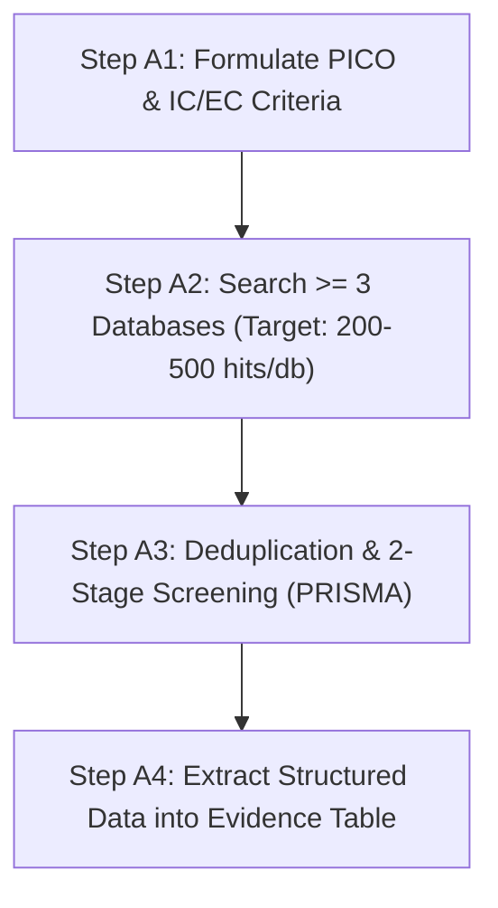

# Research Protocol & Execution Rules (RBL-ScamShield)

> **Document Status:** Mandatory Specification & Single Source of Truth (SSOT)  
> **Project Title:** ScamShield — AI-Powered Vietnamese Scam & Phishing Message Detection  
> **Core Research Question:** *"How effective are prompt-based LLMs (few-shot) compared with a fine-tuned PhoBERT model for Vietnamese scam message classification?"*  
> **Target Audience:** All research team members, investigators, and automated agents.

---

## 1. Executive Summary & Core Research Question

This repository enforces a strict, reproducible, evidence-based research framework (Research-Based Learning / RBL). Every finding, table, dataset, code change, and manuscript section must strictly adhere to the protocols defined in this document.

### Core Research Objectives:
1. **Primary RQ:** Quantitatively compare the classification performance (Macro-F1, Precision, Recall, Accuracy), computational latency, and cost-efficiency of **In-Context Learning / Few-Shot LLM Prompting** (e.g., GPT-4o mini, Gemini Flash, Claude Haiku, LLaMA-3) against **Fine-Tuned Vietnamese Pretrained Language Models (PLMs)** (e.g., `PhoBERT-base`, `PhoBERT-large`, `ViDeBERTa`).
2. **Secondary RQ (Robustness & Nuance):** Evaluate model resilience against Vietnamese adversarial scam patterns, including teencode/slang, homoglyphs/character obfuscation, diacritic omissions, and psychological urgency manipulation.
3. **Tertiary RQ (Deployment Feasibility):** Measure inference latency (ms/query), monetary API cost per 10k messages, and memory footprint to assess real-time mobile deployment viability.

---

## 2. Foundational Research Principles & Code of Ethics

All contributors must uphold the following core principles. Violations compromise scientific validity.

```
+-------------------------------------------------------------------------------+
|                        FOUNDATIONAL RESEARCH ETHICS                           |
+-------------------------------------------------------------------------------+
|  1. EVIDENCE-BASED ONLY    | Every claim must cite verified empirical data.   |
|  2. NO HARK-ing            | Hypothesizing After Results are Known is BANNED. |
|  3. NO DATA FABRICATION    | Use "N/A" honestly when papers omit metrics.     |
|  4. MANDATORY PILOT STUDY  | Test pipelines on small subsets before full runs.|
|  5. STATISTICAL RIGOR      | Paired tests (Wilcoxon/McNemar) & effect sizes.  |
+-------------------------------------------------------------------------------+
```

1. **Evidence-Based Grounding:** No arbitrary assertions. Every baseline, threshold, hyperparameter, and metric choice must trace back to cited literature in the Evidence Table or recorded pilot data.
2. **Strict Prohibition of HARKing (No Hypothesizing After Results are Known):**
   - Research Questions (RQs), hypotheses, evaluation metrics, and primary test splits must be locked **before** examining test set outputs.
   - Post-hoc observations must be explicitly labeled as *"Exploratory / Post-hoc Analysis"*.
3. **Zero-Tolerance for AI Hallucinations & Fabricated Data:**
   - When extracting data from literature: If a paper does not explicitly disclose a metric, code link, or sample size, record **`N/A`**.
   - An Evidence Table with genuine `N/A` entries demonstrates honest scientific inquiry. Complete absence of `N/A` across diverse papers is considered a critical red flag for AI hallucination.
4. **Mandatory Pilot Phase:**
   - Any experimental pipeline (data preprocessing, prompt templates, fine-tuning scripts, evaluation metrics) must be piloted on a small validation partition ($N \approx 50\text{--}100$) before full-scale execution to prevent wasted compute and API expenditure.
5. **Rigorous Statistical Hypothesis Testing:**
   - Point estimates alone (e.g., saying Model A scored 92.1% vs Model B's 91.8%) are insufficient.
   - For continuous performance metrics across multiple folds/runs: Apply **Wilcoxon Signed-Rank Test** ($p < 0.05$).
   - For paired binary classification decisions on discrete test instances: Apply **McNemar’s Test** or **Binomial Exact Test**.
   - Always report effect sizes (**Cliff's delta** or **Cohen's $d$**) and 95% Confidence Intervals (CI).

---

## 3. Team Organization, Role Separation & Git Conventions

### 3.1 Role Separation Constraint
To eliminate confirmation bias and ensure experimental integrity:
- **Literature Reviewer (LR)** and **Modeling / Systems Specialist (MS)** **MUST NOT** be the same individual.

| Role | Abbreviation | Core Responsibilities |
| :--- | :--- | :--- |
| **Project Lead** | `PL` | Repository oversight, phase milestone tracking, merging evidence tables, PR approvals. |
| **Literature Reviewer** | `LR` | Systematic Literature Review (SLR), query formulation, PRISMA tracking, paper extraction. |
| **Modeling / Systems Specialist** | `MS` | Model development, prompt engineering, PhoBERT fine-tuning, training pipelines. |
| **Data & Evaluation Specialist** | `DS` | Dataset curation, annotation guidelines, statistical testing, metric computations. |

### 3.2 Git Commit Message Protocol
All commit messages must follow standardized prefix tags to maintain clear traceability:

```text
[<TAG>] <Imperative summary of changes> (max 72 chars)

[Optional detailed explanation of rationale, methodology, or references]
```

**Allowed Commit Tags:**
- `[SLR]` : Systematic Literature Review updates (search logs, PRISMA CSVs, evidence tables).
- `[GAP]` : Gap analysis, counter-evidence matrices, feasibility evaluations.
- `[DATA]` : Dataset acquisition, cleaning scripts, annotation logs, schema definitions.
- `[MODEL]` : Prompt engineering, fine-tuning scripts, model weights/checkpoints.
- `[EXP]` : Experiment executions, pilot runs, benchmark evaluations.
- `[STAT]` : Statistical significance testing, confidence interval computations.
- `[PAPER]` : LaTeX drafting, manuscript revisions, bibliography updates.
- `[DOC]` : Rules, documentation, guidelines, meeting notes.

---

## 4. Repository & Directory Structure Specification

The repository must strictly adhere to the following directory layout:

```
RBL_ScamShield/
├── RESEARCH_RULES.md               # [THIS FILE] Single Source of Truth & Rules
├── README.md                       # Project landing overview
├── data/
│   ├── raw/                        # Immutable original raw datasets
│   ├── processed/                  # Normalized, cleaned, tokenized datasets
│   └── annotations/                # Gold-standard annotation logs & schemas
├── scripts/
│   ├── data_prep/                  # Preprocessing, regex cleaning, teencode mapping
│   ├── models/
│   │   ├── prompt_llm/             # Few-shot, zero-shot, and CoT prompt runners
│   │   └── finetune_phobert/       # HuggingFace fine-tuning scripts for PhoBERT/ViDeBERTa
│   └── evaluation/                 # Metric computation, statistical tests, error analysis
├── results/
│   ├── pilot/                      # Pilot run metrics, sample outputs, logs
│   ├── final/                      # Consolidated evaluation metrics, confusion matrices
│   └── logs/                       # API call traces, prompt logs, token counters
├── figures/                        # High-resolution vector diagrams, PRISMA charts, plots
├── paper/                          # LaTeX source files, .bib bibliography, compiled PDF
├── presentation/                   # Proposal slides & final defense slide decks
└── [member_id]/                    # Individual member workspace (e.g., minh_quang/)
    └── SLR/
        ├── 01_all_records.csv      # Raw exported search records (deduplicated)
        ├── 02_after_screening_v1.csv # Records retained after Title + Abstract screening
        ├── 03_final_included.csv   # Final papers retained after Full-Text screening (>= 5)
        ├── search-log.md           # Exact search queries, databases, dates, hit counts
        ├── evidence-table.md       # Extracted 7-field structured evidence table
        └── gap-analysis.md         # Individual GAP report with feasibility & counter-evidence
```

---

## 5. Phase A: Individual Systematic Literature Review (SLR) Protocol

Each individual researcher must independently execute the 4-step SLR process during Weeks 3–4.



### Step A1: PICO Search Criteria & Selection Bounds

| Element | Parameter | Research Definition |
| :--- | :--- | :--- |
| **Population (P)** | Target Domain | Vietnamese SMS messages, conversational chat, phishing/smishing text, financial fraud messages. |
| **Intervention (I)** | Primary Approach | In-context LLM Prompting (Zero-shot, Few-shot, Chain-of-Thought, Prompt Optimization). |
| **Comparison (C)** | Baseline Approach | Fine-tuned Pretrained Language Models (`PhoBERT-base`, `PhoBERT-large`, `ViDeBERTa`, BERT baselines). |
| **Outcome (O)** | Evaluation Metrics | Macro-F1, Precision, Recall, Accuracy, False Positive Rate (FPR), Latency (ms), Token Cost ($). |

#### Inclusion Criteria (IC):
- **IC1:** Published or preprint dated **$\ge 2020$** (for LLM-specific papers: preferably **$\ge 2023$**).
- **IC2:** Peer-reviewed conference/journal (IEEE, ACM, ACL, EMNLP, NAACL, Springer, Elsevier) OR credible preprint repository (arXiv).
- **IC3:** Directly investigates text classification, spam/phishing/scam detection, or NLP in Vietnamese / low-resource languages.
- **IC4:** Evaluates Transformer-based PLMs, Large Language Models, prompt-based architectures, or comparative frameworks.

#### Exclusion Criteria (EC):
- **EC1:** Papers focusing solely on non-textual network security (e.g., IP routing, packet header analysis, hardware firewalls).
- **EC2:** Papers with non-reproducible evaluation (missing sample size, undefined metrics, purely speculative whitepapers).
- **EC3:** Non-English and non-Vietnamese publications.
- **EC4:** Exact duplicate publications or superseded preprints.

---

### Step A2: Multi-Database Search Execution

Searches must be executed across at least **three (3)** major academic databases:
1. **ArXiv** (`arxiv.org`)
2. **OpenAlex** (`openalex.org`)
3. **Semantic Scholar** / **IEEE Xplore** / **ACM Digital Library**

#### Calibrated Search Strings (Aiming for 200–500 hits sweet spot):

* **ArXiv Query (Abstract Field):**
  ```text
  abs:("phishing" OR "spam" OR "scam" OR "smishing") AND abs:("LLM" OR "large language model" OR "few-shot" OR "prompt") AND abs:("fine-tuning" OR "BERT" OR "baseline")
  ```

* **ArXiv Query (Vietnamese / PLM Domain):**
  ```text
  all:("Vietnamese" OR "PhoBERT") AND all:("spam" OR "scam" OR "phishing" OR "text classification") AND all:("language model" OR "BERT" OR "LLM")
  ```

* **OpenAlex Query (Filtered $\text{Year} \ge 2023$):**
  ```text
  ("phishing detection" OR "smishing" OR "SMS spam" OR "scam message") AND ("large language model" OR "LLM" OR "few-shot" OR "prompt-based") AND ("fine-tuning" OR "BERT" OR "comparison")
  ```

* **Semantic Scholar / IEEE Query:**
  ```text
  ("phishing" OR "smishing" OR "scam message" OR "SMS spam") AND ("few-shot" OR "prompt-based" OR "LLM") AND ("fine-tuning" OR "BERT" OR "PhoBERT")
  ```

#### Search Log Requirement (`search-log.md`):
Every search must be recorded with exact timestamp, query string, platform filters, raw count, and post-deduplication count.

---

### Step A3: 2-Stage Screening & Strict PRISMA Compliance

```
[Raw Records from >= 3 Databases]
               │
               ▼
      [Deduplication] ───────────► Saved as: 01_all_records.csv
               │
               ▼
[Round 1: Title + Abstract Screening] ──► Saved as: 02_after_screening_v1.csv
               │
               ▼
[Round 2: Full-Text Reading] ──────────► Saved as: 03_final_included.csv (N >= 5)
```

**PRISMA Integrity Constraint:**
The row counts in `01_all_records.csv`, `02_after_screening_v1.csv`, and `03_final_included.csv` must **exactly match** the numbers reported in the PRISMA Flow Diagram in the manuscript.

---

### Step A4: Evidence Table Data Extraction (`evidence-table.md`)

Each included paper ($\ge 5$ papers per member) must have the following **seven (7) mandatory fields** extracted without approximation:

| Field | Description & Formatting Rule | Example / Valid Entry |
| :--- | :--- | :--- |
| **1. Paper** | Title, Year, Venue, and active DOI/URL link. | `SpaLLM-Guard, 2025, IEEE Access, https://doi.org/10.1109/...` |
| **2. Tool / LLM** | Exact named models (no generic "AI model"). | `GPT-4o mini, PhoBERT-base, LLaMA-3-8B-Instruct` |
| **3. Dataset** | Name, sample size ($N$), domain, and test split. | `VN-ScamSMS (N=3,500), 20% test split, SMS & Zalo text` |
| **4. Metric** | Specific evaluation metrics (no generic "accuracy"). | `Macro-F1, Precision, Recall, Latency (ms/sample)` |
| **5. Results** | Exact numeric values extracted from tables/text. | `PhoBERT F1: 93.4%, GPT-4o few-shot F1: 89.2% (N/A for Latency)` |
| **6. Code** | Official repository link or `N/A`. | `https://github.com/org/repo` OR `N/A` |
| **7. Limitations**| Threats to validity directly stated by authors. | `Small sample size (N < 500); evaluated only on English text` |

---

## 6. Phase B: Group Consolidation & GAP Taxonomy (Week 5)

### 6.1 Merged Evidence Table
The Project Lead (`PL`) merges all members' `03_final_included.csv` into a central `merged_evidence_table.md`, removing duplicate entries while retaining the most detailed extraction.

### 6.2 The 4-Category GAP Taxonomy
Identified research gaps must be classified under one of the four standardized categories:

```
                   +──────────────────────────────────+
                   |       RESEARCH GAP TAXONOMY      |
                   +──────────────────────────────────+
                                    │
    ┌───────────────┬───────────────┴───────────────┬───────────────┐
    ▼               ▼                               ▼               ▼
 [GAP-T]         [GAP-M]                         [GAP-D]         [GAP-S]
Technological  Measurement &                    Data & Domain   Systematic &
& Model Gaps   Evaluation Gaps                  Scarcity Gaps   Methodological
```

- **GAP-T (Technological & Model Architecture):** Untested prompting strategies (e.g., Chain-of-Thought with Vietnamese exemplar selection), lack of head-to-head comparisons between modern lightweight LLMs (GPT-4o-mini, Gemini 1.5 Flash) and specialized fine-tuned Vietnamese PLMs (`PhoBERT`).
- **GAP-M (Measurement & Metric Calibration):** Prior works evaluate only Accuracy/F1 while omitting real-world deployment metrics such as token cost per inference, API round-trip latency, and confidence calibration under adversarial evasion.
- **GAP-D (Data & Domain Realism):** Existing benchmarks rely on clean synthetic or English-translated SMS datasets, failing to represent Vietnamese linguistic nuances (teencode, tone mark variations, dialectal slang, brand spoofing).
- **GAP-S (Systematic & Methodological Rigor):** Lack of paired statistical significance tests (Wilcoxon/McNemar), arbitrary prompt selection without ablation, or zero cross-validation.

### 6.3 Unique GAP Assignment Rule
- Every team member must select **one unique, non-overlapping GAP** documented in `gap-list.md`.
- No two members may claim the same GAP.

---

## 7. RBL-2: Individual GAP Analysis & Feasibility Protocol (`gap-analysis.md`)

Each member must compile their individual `SLR/gap-analysis.md` report complying with the following 5-part structure:

### Part 1: GAP Description & Evidence Grounding
- Explicitly trace the GAP back to patterns observed across the Evidence Table (e.g., *"5 out of 7 analyzed papers evaluate only English datasets; no existing work benchmarks few-shot LLMs against fine-tuned PhoBERT on Vietnamese scam messages"*).

### Part 2: Counter-Evidence Matrix & Supplementary Validation
- **Counter-Evidence Verification:** Cross-check all included papers in a table to confirm none have resolved this exact GAP.
- **3-Layer Supplementary Validation (Mandatory if group included papers $N < 10$):**
  - **L1 (Targeted Search):** Direct keyword queries on Google Scholar / IEEE targeting the specific GAP.
  - **L2 (Citation Network):** Citation graph exploration via Semantic Scholar / ResearchRabbit.
  - **L3 (Survey Verification):** Verification against systematic reviews/surveys published $\ge 2023$.

### Part 3: 7-Factor Feasibility Evaluation Matrix
Each proposed GAP must be rigorously evaluated across 7 operational constraints:

| Feasibility Factor | Evaluation Question | Status Criteria ($\checkmark$ / $\triangle$ / $\times$) |
| :--- | :--- | :--- |
| **1. Dataset** | Is an annotated Vietnamese scam dataset accessible without $>1$ month data collection? | $\checkmark$ Public/ready; $\triangle$ Needs preprocessing; $\times$ Unobtainable. |
| **2. API / Tooling** | Are LLM API keys (OpenAI / Google / Anthropic) and HuggingFace accessible within budget? | $\checkmark$ Funded/free tier; $\triangle$ Budget cap needed; $\times$ Paywalled. |
| **3. Compute** | Can PhoBERT fine-tuning execute within available GPU resources (e.g., Google Colab T4/V100)? | $\checkmark$ Single T4 GPU; $\triangle$ Needs batch tuning; $\times$ Multi-GPU cluster. |
| **4. Ground Truth** | Can scam vs ham labels be verified objectively against standard criteria? | $\checkmark$ Verified labels; $\triangle$ Needs audit; $\times$ Subjective/ambiguous. |
| **5. Codebase** | Are standard libraries available (PyTorch, Transformers, Scikit-learn)? | $\checkmark$ Mature libraries; $\triangle$ Custom wrapper; $\times$ No open implementation. |
| **6. Skill Set** | Does the researcher possess Python, PyTorch, and prompt engineering competence? | $\checkmark$ Competent; $\triangle$ Needs learning curve; $\times$ Out of scope. |
| **7. Time Budget** | Can all experiments and statistical tests complete within the semester timeline? | $\checkmark$ Feasible; $\triangle$ Tight buffer; $\times$ Over-scoped. |

#### Decision Rules:
- **Disqualified ($\times$):** Any single $\times$ requires immediate disqualification or mandatory downscoping.
- **High Risk ($\ge 3\,\triangle$):** Requires an explicit risk mitigation plan before approval.
- **Approved ($\le 2\,\triangle$ and $0\,\times$):** Fully validated and safe to execute.

#### Downscope Strategies:
- Restrict scope from multi-turn dialogues to single-turn SMS/chat messages.
- Use cost-effective models (e.g., `gpt-4o-mini`, `gemini-1.5-flash`) instead of expensive flagship models.
- Downsample test set size ($N \approx 500\text{--}1000$) with stratified sampling for rigorous statistical testing.

### Part 4: Formal GAP Statement
A crisp, 1–2 sentence formal statement suitable for direct inclusion in the proposal:
> *"While fine-tuned PhoBERT achieves high accuracy on standard Vietnamese NLP benchmarks, the relative efficacy, cost-efficiency, and adversarial robustness of few-shot prompt-based LLMs compared to fine-tuned PhoBERT for Vietnamese scam message classification remains unquantified."*

### Part 5: Preliminary Technical Proposal
- **Target Dataset:** Vietnamese scam/ham message benchmark.
- **Evaluated Models:** `PhoBERT-base` (Fine-tuned), `PhoBERT-large` (Fine-tuned), `GPT-4o-mini` (0-shot & 5-shot), `Gemini-1.5-Flash` (0-shot & 5-shot).
- **Core Metrics:** Macro-F1, Precision, Recall, Specificity, Latency (ms), Cost ($ / 10k messages).
- **Statistical Tests:** 5-fold cross-validation with paired Wilcoxon signed-rank test.

---

## 8. Experimental & Evaluation Standards (Execution Phase)

During the execution phase, all experimental code in `scripts/` must adhere to these standards:

### 8.1 Data Preprocessing & Leakage Prevention
- **Strict Split Isolation:** Data cleaning, vocabulary generation, and tokenization statistics must be fitted solely on the **Training Set** and applied to the Test Set.
- **Stratified Splitting:** All train/val/test splits (e.g., 70/15/15 or 80/10/10) must use stratified sampling to preserve the class balance between scam and benign messages.
- **Deterministic Seed:** All splits, weight initializations, and sampling routines must use a fixed random seed (`seed = 42`).

### 8.2 Prompt Engineering Protocol for LLMs
- **Few-Shot Exemplar Selection:** Exemplars used in few-shot prompts must be drawn **exclusively from the Training Set**. Zero overlap with the Test Set is permitted.
- **Prompt Variations:** Test at least three structured prompt paradigms:
  1. *Zero-Shot Directive:* Direct classification instruction with label definitions.
  2. *Few-Shot (3–5 shots):* Balanced positive/negative exemplars with reasoning annotations.
  3. *Few-Shot Chain-of-Thought (CoT):* Step-by-step psychological trigger identification before final classification.
- **Deterministic Output:** Set LLM generation `temperature = 0.0` for all classification benchmarks to guarantee reproducible responses.

### 8.3 Fine-Tuning Protocol for PhoBERT
- Base checkpoint: `vinai/phobert-base-v2` and `vinai/phobert-large`.
- Input processing: Use `pyvi` or `rdrsegmenter` for Vietnamese word segmentation prior to subword tokenization as required by PhoBERT architecture.
- Hyperparameter search space must be logged: Learning rate ($1\text{e-}5$ to $5\text{e-}5$), batch size (16, 32), AdamW optimizer with linear warmup and weight decay ($0.01$).

### 8.4 Evaluation Metrics Calculation
All metrics must be computed using `scikit-learn` with explicit macro-averaging:
$$\text{Macro-F1} = \frac{1}{C}\sum_{c=1}^{C} \frac{2 \cdot P_c \cdot R_c}{P_c + R_c}$$
Where $C$ is the number of classes (Scam vs. Ham).

---

## 9. Quality Checklist & Verification Protocol

Before submitting any milestone (RBL-1 through RBL-5b), verify against this checklist:

- [ ] Directory paths strictly match Section 4 specifications.
- [ ] No file contains fabricated numbers or unverified citations.
- [ ] Every individual's `03_final_included.csv` contains $\ge 5$ verified papers.
- [ ] Row counts in CSV screening files perfectly align with the PRISMA diagram.
- [ ] `evidence-table.md` contains all 7 mandatory columns with named models and exact metrics.
- [ ] `gap-analysis.md` passes all 7 feasibility criteria without unmitigated $\times$ marks.
- [ ] Counter-evidence matrix explicitly demonstrates gap novelty.
- [ ] Random seeds, prompt templates, and hyperparameter configurations are fully recorded for 100% reproducibility.
- [ ] All commit messages adhere to Section 3.2 tagging conventions.

---

*This document represents the immutable research framework for the ScamShield project. Any amendments must be submitted via Pull Request and approved by the Project Lead (`PL`).*
