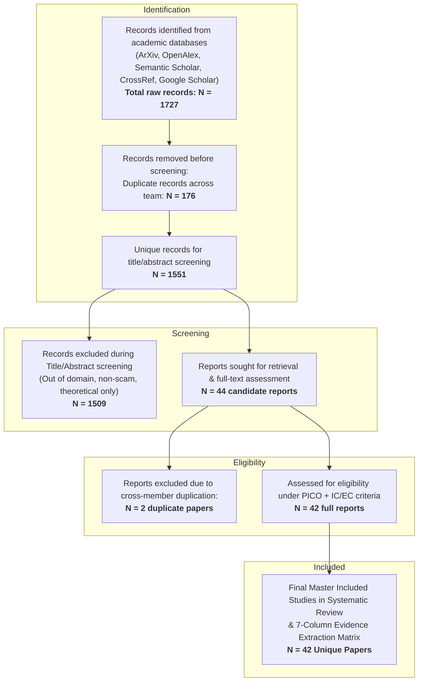

# PRISMA 2020 Flow Diagram - Master Synthesis (ScamShield RBL)

### PRISMA Flow Synthesis Statistics:
1. **Total Records Identified (Identification Phase):** `1727` records across 5 researchers.
2. **Unique Records Screened (Screening Phase):** `1551` records after global deduplication.
3. **Cross-Member Candidate Papers Assessed:** `44` candidate papers.
4. **Final Unique Studies Included in Master Matrix:** `42` peer-reviewed empirical studies.
