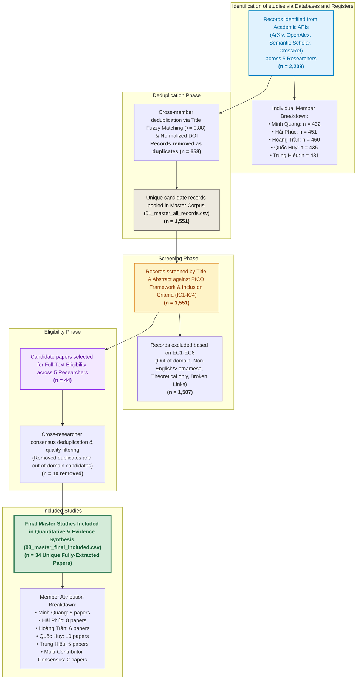

# PRISMA 2020 Master Flow Diagram
## Multi-Researcher Systematic Literature Review Synthesis (34 Final Core Papers)

```mermaid
flowchart TD
    subgraph Identification ["Identification of studies via Databases and Registers"]
        A1["Records identified from Academic APIs<br>(ArXiv, OpenAlex, Semantic Scholar, CrossRef)<br>across 5 Researchers<br><b>(n = 2,209)</b>"]
        A2["Individual Member Breakdown:<br>• Minh Quang: n = 432<br>• Hải Phúc: n = 451<br>• Hoàng Trần: n = 460<br>• Quốc Huy: n = 435<br>• Trung Hiếu: n = 431"]
        A1 --> A2
    end

    subgraph Deduplication ["Deduplication Phase"]
        B1["Cross-member deduplication via Title Fuzzy Matching (>= 0.88) & Normalized DOI<br><b>Records removed as duplicates (n = 658)</b>"]
        B2["Unique candidate records pooled in Master Corpus (01_master_all_records.csv)<br><b>(n = 1,551)</b>"]
        A1 --> B1
        B1 --> B2
    end

    subgraph Screening ["Screening Phase"]
        C1["Records screened by Title & Abstract against PICO Framework & Inclusion Criteria (IC1-IC4)<br><b>(n = 1,551)</b>"]
        C2["Records excluded based on EC1-EC6<br>(Out-of-domain, Non-English/Vietnamese, Theoretical only, Broken Links)<br><b>(n = 1,507)</b>"]
        B2 --> C1
        C1 --> C2
    end

    subgraph Eligibility ["Eligibility Phase"]
        D1["Candidate papers selected for Full-Text Eligibility across 5 Researchers<br><b>(n = 44)</b>"]
        D2["Cross-researcher consensus deduplication & quality filtering<br>(Removed duplicates and out-of-domain candidates)<br><b>(n = 10 removed)</b>"]
        C1 --> D1
        D1 --> D2
    end

    subgraph Included ["Included Studies"]
        E1["<b>Final Master Studies Included in Quantitative & Evidence Synthesis (03_master_final_included.csv)</b><br><b>(n = 34 Unique Fully-Extracted Papers)</b>"]
        E2["Member Attribution Breakdown:<br>• Minh Quang: 5 papers<br>• Hải Phúc: 8 papers<br>• Hoàng Trần: 6 papers<br>• Quốc Huy: 10 papers<br>• Trung Hiếu: 5 papers<br>• Multi-Contributor Consensus: 2 papers"]
        D2 --> E1
        E1 --> E2
    end

    style A1 fill:#E0F2FE,stroke:#0284C7,stroke-width:2px,color:#0369A1
    style B2 fill:#EDE9DF,stroke:#7A766F,stroke-width:2px,color:#1A1917
    style C1 fill:#FEF3C7,stroke:#D97706,stroke-width:2px,color:#92400E
    style D1 fill:#F3E8FF,stroke:#9333EA,stroke-width:2px,color:#6B21A8
    style E1 fill:#D4EBD9,stroke:#2D7A53,stroke-width:3px,color:#1E5E3A
```
