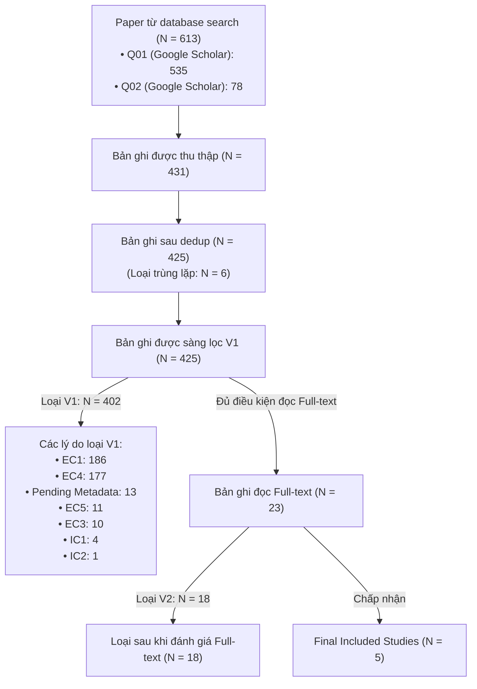

# PRISMA Flow Diagram

## 1. Flowchart Summary

```text
[Paper từ database search (N = 613: Q01=535, Q02=78)]
        ↓
[Thu thập bản ghi (N = 431)]
        ↓
[Sau dedup (N = 425, loại trùng lặp N = 6)]
        ↓
[Loại V1 (N = 402): EC1=186, EC4=177, Pending=13, EC5=11, EC3=10, IC1=4, IC2=1]
        ↓
[Full-text đọc (N = 23)]
        ↓
[Loại V2 (N = 18)]
        ↓
[Final included (N = 5)]
```

## 2. Mermaid Diagram



## 3. Detailed Stage Breakdown

| Giai đoạn (Stage) | Số lượng (Count) | Ghi chú & Chi tiết (Notes & Details) |
| :--- | :--- | :--- |
| **Database Search Hits** | **613** | Q01 (`LLMs & Vietnamese Scam/Spam`): 535<br/>Q02 (`PhoBERT & Scam/Spam`): 78 |
| **Retrieved Records** | **431** | Bản ghi trích xuất đưa vào `01_all_records.csv` |
| **Deduplicated Records** | **425** | Loại 6 bản ghi trùng lặp |
| **Screened V1 (Title & Abstract)** | **425** | Sàng lọc tiêu đề và tóm tắt (`02_after_screening_v1.csv`) |
| **Excluded V1** | **402** | **EC1** (186), **EC4** (177), **Pending** (13), **EC5** (11), **EC3** (10), **IC1** (4), **IC2** (1) |
| **Retrieved for Full-Text (V2)** | **23** | Các bài báo vượt qua vòng sàng lọc V1 |
| **Excluded V2 (Full-Text)** | **18** | Loại sau khi đọc toàn văn chi tiết |
| **Final Included Studies** | **5** | Đưa vào tổng hợp kết quả (`03_final_included.csv`) |
