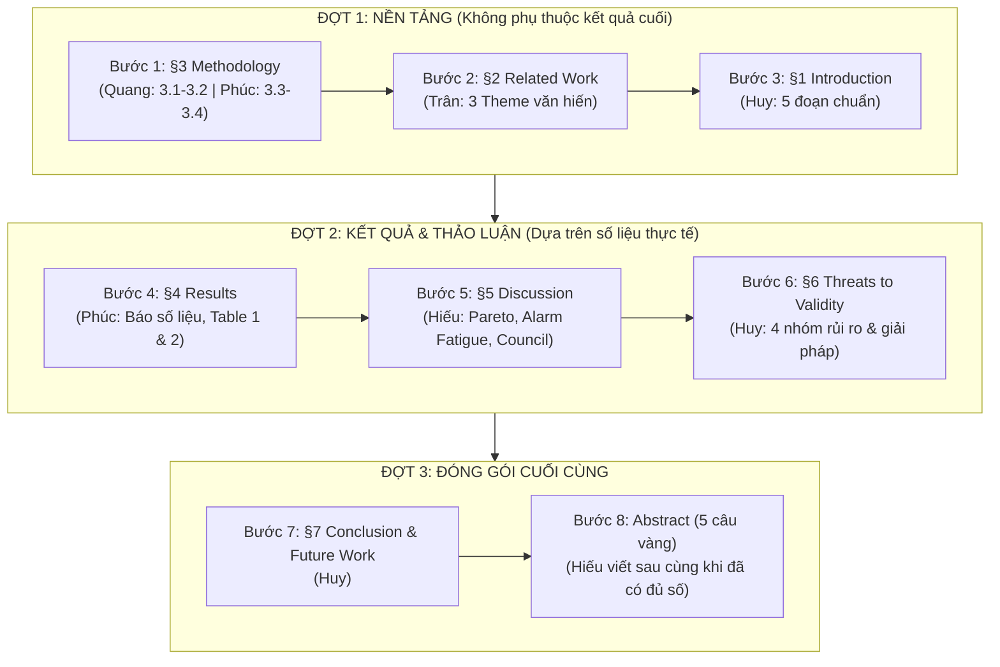

# 📋 BẢN PHÂN CÔNG VIẾT BÀI BÁO RBL & LỘ TRÌNH PHỐI HỢP 5 THÀNH VIÊN
### Đề tài: ScamShield-VN — Evidence-Grounded Vietnamese Scam & Phishing Detection Platform
> **File:** `paper/WRITING_GUIDE_AND_ASSIGNMENT.md`  
> **Áp dụng cho:** Cả 5 thành viên (Hiếu, Huy, Phúc, Trân, Quang)  
> **Quy chuẩn đối soát:** [`rbl_docs/01_tong_quan.md`](file:///C:/Users/USER/RBL_ScamShield/rbl_docs/01_tong_quan.md) & [`rbl_docs/05_huong_dan_viet.md`](file:///C:/Users/USER/RBL_ScamShield/rbl_docs/05_huong_dan_viet.md)

---

## 1. Bảng Phân Công Nhiệm Vụ 5 Thành Viên

| Thành viên | Vai trò RBL | Section phụ trách chính | File LaTeX tương ứng | Nguyên liệu cần mở trong repo để lấy số liệu |
| :--- | :---: | :--- | :--- | :--- |
| **Nguyễn Trung Hiếu** | **PL** (Project Lead) & Modeling | • **Abstract** (Tóm tắt 5 câu vàng) • **§5 Discussion** (Thảo luận sâu & Trade-offs) | `sections/00_abstract.tex` `sections/05_discussion.tex` | • `results/summary.csv` • `notes.md` • `team-synthesis/proposal_amendment_v1.1.md` |
| **Lê Quốc Huy** | **RW** (Report Writer) | • **§1 Introduction** (Bối cảnh & GAPs) • **§6 Threats to Validity** (4 Threats) • **§7 Conclusion** (Kết luận & Future Work) | `sections/01_intro.tex` `sections/06_threats.tex` `sections/07_conclusion.tex` | • `team-synthesis/proposal.md` (§2, §7) • `team-synthesis/gap-list.md` • `figures/` (Fig 1 & Fig 2) |
| **Phan Trần Hoàng Trân** | **DG** (Data & Ground Truth) | • **§2 Related Work** (Tổng hợp 3 Theme) • Đối soát bảng so sánh văn hiến | `sections/02_related.tex` | • `team-synthesis/evidence-table-merged.md` • `team-synthesis/ie_criteria.md` • `data/raw/README.md` |
| **Nguyễn Minh Quang** | **LR** (LLM & Pipeline Runner) | • **§3.1 Dataset & Ground Truth** • **§3.2 Pipeline Setup & Quantization** | `sections/03_method.tex` *(Mục 3.1 & 3.2)* | • `data/raw/vietnamese_sms_merged_all.csv` • `models/scamshield_config.json` • `team-synthesis/proposal.md` (§5.1-§5.3) |
| **Hoàng Hải Phúc** | **MS** (Metrics & Statistics) | • **§3.3 Metrics & Loss Function** • **§3.4 Statistical Testing Protocol** • **§4 Results** (Chỉ báo số liệu thực tế) | `sections/03_method.tex` *(Mục 3.3 & 3.4)* `sections/04_results.tex` | • `results/summary.csv` • `results/summary_5runs_detailed.csv` • `results/mcnemar_analysis.csv` |

> [!CRITICAL]
> **Quy tắc sống còn RBL: $\text{LR} \neq \text{MS}$**  
> Minh Quang (LR) phụ trách phần pipeline mô hình và dữ liệu đầu vào. Hải Phúc (MS) phụ trách độc lập phần công thức toán, metric và kết quả thống kê. Tuyệt đối không hoán đổi hoặc gộp việc để đảm bảo tính khách quan khoa học.

---

## 2. Thứ Tự Viết Chuẩn Khoa Học (Writing Sequence Roadmap)

Viết bài báo khoa học **KHÔNG ĐƯỢC VIẾT THEO THỨ TỰ TUYẾN TÍNH (§1 $\rightarrow$ §7)**. Theo cẩm nang học thuật, thứ tự chuẩn gồm **3 đợt**:

### 📅 LỊCH TRÌNH VÀ DEADLINE CỤ THỂ CHO TỪNG ĐỢT (04/10/2026 – 15/10/2026)

| Đợt viết | Bước / Section | Thành viên phụ trách | Hạn chót (Deadline) | Tiêu chí nghiệm thu của đợt |
| :---: | :--- | :--- | :---: | :--- |
| **ĐỢT 1** *(Nền tảng)* | **Bước 1: $\S 3$ Methodology** • 3.1 & 3.2: Dataset, Pipeline, ONNX • 3.3 & 3.4: Loss WBCE, Protocol | **Quang** (LR) **Phúc** (MS) | **2026-10-06 (Thứ Ba, 23:59)** | Cố định toàn bộ công thức toán, dataset $N=2.665$, Frozen Set $N=267$, và thông số ViSoBERT. |
| | **Bước 2: $\S 2$ Related Work** • 3 Theme văn hiến từ 40 paper • Bảng I đối sánh & Định vị GAP | **Trân** (DG) | **2026-10-07 (Thứ Tư, 23:59)** | Bảng đối sánh hoàn chỉnh, trích dẫn chuẩn 40 paper từ `evidence-table-merged.md`. |
| | **Bước 3: $\S 1$ Introduction** • Bối cảnh lừa đảo viễn thông VN • 4 đóng góp cốt lõi của đề tài | **Huy** (RW) | **2026-10-08 (Thứ Năm, 23:59)** | Viết đủ 5 đoạn chuẩn, trỏ thẳng vào GAP và đóng góp ViSoBERT. |
| **ĐỢT 2** *(Kết quả & Thảo luận)* | **Bước 4: $\S 4$ Results** • Bảng 5-runs benchmark (Table II) • Bảng McNemar tests (Table III) | **Phúc** (MS) | **2026-10-10 (Thứ Bảy, 23:59)** | Số liệu khớp 100% với `summary.csv` và `mcnemar_analysis.csv`, chỉ báo số, không suy đoán. |
| | **Bước 5: $\S 5$ Discussion** • Pareto ViSoBERT, Alarm Fatigue • Cơ sở Amendment v1.1 5-Agent | **Hiếu** (PL) **Phúc** (MS) | **2026-10-11 (Chủ Nhật, 23:59)** | Phân tích sâu 10-20 case lỗi, lý giải vì sao single-LLM thất bại và giá trị của Council. |
| | **Bước 6: $\S 6$ Threats to Validity** • Internal, External, Construct, Conclusion | **Huy** (RW) | **2026-10-12 (Thứ Hai, 23:59)** | Đủ 4 nhóm rủi ro, mỗi nhóm có mitigation action cụ thể. |
| **ĐỢT 3** *(Đóng gói & Nghiệm thu)* | **Bước 7: $\S 7$ Conclusion** • Trả lời RQ, Future work & AI Declaration | **Huy** (RW) | **2026-10-13 (Thứ Ba, 23:59)** | Đúc kết ngắn gọn, có AI Usage Declaration theo chuẩn RBL-5b. |
| | **Bước 8: Abstract** • Cấu trúc vàng 5 câu có số thực chứng | **Hiếu** (PL) | **2026-10-13 (Thứ Ba, 23:59)** | Viết sau cùng, có đủ số $N=267$, Recall $95.62\%$, $p < 0.0001$. |
| | **Bước 9: Review chéo & AI Writing Check** • Cả nhóm rà soát, ghi `ai_check_log.md` | **Cả 5 thành viên** | **2026-10-14 (Thứ Tư, 23:59)** | Đảm bảo tỷ lệ phát hiện AI $\le 18\%$, không có câu thụ động sáo rỗng. |
| | **Bước 10: Recompile PDF & Slide Rehearsal** • Xuất `paper_final.pdf` trên Overleaf • Khớp slide `slides_final.pptx` (10-12 phút) | **Hiếu** (PL) **Huy** (RW) | **2026-10-15 (Thứ Năm, 23:59)** | File PDF 2 cột chuẩn IEEE (6-8 trang) compile không lỗi, sẵn sàng nộp GVHD ngày 16/10. |

---

### Chi tiết các đợt viết:

#### 🟢 Đợt 1: Viết phần nền tảng (05/10 – 08/10/2026)
1. **Bước 1 — Viết $\S 3$ Methodology (Quang + Phúc) [Hạn: 06/10]:**  
   * Vì dataset, mô hình ViSoBERT, công thức $\mathcal{L}_{\text{WBCE}}$ ($\alpha=5.0$) và Frozen test set $N=267$ đã niêm phong từ trước. Viết xong phần này sẽ cố định thuật ngữ kỹ thuật cho toàn bài.
2. **Bước 2 — Viết $\S 2$ Related Work (Trân) [Hạn: 07/10]:**  
   * Lấy từ 40 bài báo trong `evidence-table-merged.md`. Nhóm thành 3 theme rõ ràng và viết bảng so sánh.
3. **Bước 3 — Viết $\S 1$ Introduction (Huy) [Hạn: 08/10]:**  
   * Khi đã có $\S 2$ và $\S 3$, việc viết $\S 1$ sẽ rất mượt vì Huy đã nắm rõ vấn đề thực tế, các nghiên cứu đi trước và khoảng trống GAP mà nhóm giải quyết.

#### 🟡 Đợt 2: Đưa số liệu và phân tích chuyên sâu (09/10 – 12/10/2026)
4. **Bước 4 — Viết $\S 4$ Results (Phúc) [Hạn: 10/10]:**  
   * Đưa bảng số liệu 5-runs từ `results/summary.csv` và kiểm định McNemar từ `results/mcnemar_analysis.csv`. Nhớ nguyên tắc: **Chỉ báo số liệu, tuyệt đối KHÔNG suy đoán nguyên nhân**.
5. **Bước 5 — Viết $\S 5$ Discussion (Hiếu + Phúc) [Hạn: 11/10]:**  
   * Dựa vào số liệu ở $\S 4$, Hiếu phân tích lý do vì sao ViSoBERT đạt Pareto, mổ xẻ nguyên nhân Gemini bị Alarm Fatigue (Precision sụt còn $64.47\%$), và giải thích vì sao cần nâng cấp lên Hội đồng 5 AI trong Amendment v1.1.
6. **Bước 6 — Viết $\S 6$ Threats to Validity (Huy) [Hạn: 12/10]:**  
   * Rà soát 4 threats theo cấu trúc: Vấn đề là gì $\rightarrow$ Ảnh hưởng gì $\rightarrow$ Nhóm đã làm gì để giảm thiểu.

#### 🔴 Đợt 3: Đóng gói và nghiệm thu (13/10 – 15/10/2026)
7. **Bước 7 — Viết $\S 7$ Conclusion (Huy) [Hạn: 13/10]:**  
   * Tóm tắt trả lời RQ, nêu hạn chế chính và 3 hướng Future Work.
8. **Bước 8 — Viết Abstract (Hiếu) [Hạn: 13/10]:**  
   * **Viết sau cùng!** Đủ 5 câu vàng, nhấc con số thực chứng chính xác từ $\S 4$ vào (Recall $95.62\%$, F1 $92.51\%$, $p < 0.0001$).
9. **Bước 9 — Review chéo & Chạy AI Writing Check (Cả nhóm) [Hạn: 14/10]:**  
   * Cả 5 người kiểm tra chéo lẫn nhau, điền `ai_check_log.md`.
10. **Bước 10 — Biên dịch Overleaf & Slide Rehearsal (Hiếu + Huy) [Hạn: 15/10]:**  
    * Xuất `paper_final.pdf` và tổng duyệt thuyết trình slides nghiệm thu (10-12 phút).

---

## 3. Hướng Dẫn Từng Thành Viên Khi Mở File Khung Sườn (.tex)

Trong mỗi file `paper/sections/0X_*.tex`, nhóm đã cài sẵn **Bộ Khung Sườn (Scaffolding)** gồm:
1. Header comment ghi rõ: Người phụ trách, nguyên liệu trong repo, checklist kiểm tra.
2. Cấu trúc các đoạn văn đã phân chia theo dàn ý học thuật chuẩn IEEE.
3. Các đoạn text mẫu và công thức toán học/bảng biểu đã gắn sẵn số liệu thực nghiệm.
4. Các thẻ `% [TODO: Tên thành viên]` đánh dấu những vị trí thành viên cần:
   - Đọc lại xem câu từ có mượt mà không.
   - Bổ sung diễn đạt theo góc nhìn chuyên môn của mình.
   - Thêm các trích dẫn `\cite{}` nếu cần thiết.
   - Đảm bảo tuân thủ quy tắc thì của động từ (Past tense cho việc nhóm làm, Present tense cho Bảng/Hình).

---

## 4. Quy Trình Phối Hợp & Review Nhóm

1. **Làm việc độc lập:** Mỗi thành viên mở đúng file `.tex` được phân công trong thư mục `paper/sections/`.
2. **Kiểm tra chéo (Peer Review):**
   * Huy (RW) review văn phong của Trân và Quang.
   * Phúc (MS) review tính chuẩn xác của các con số do Hiếu viết trong $\S 5$.
   * Hiếu (PL) review tổng thể tính liền mạch từ $\S 1$ đến $\S 7$.
3. **Kiểm tra AI (RBL-5b):**
   * Sau khi hoàn tất bài viết, chạy công cụ phát hiện văn phong AI và cập nhật vào [`paper/quality/ai_check_log.md`](file:///C:/Users/USER/RBL_ScamShield/paper/quality/ai_check_log.md) (đảm bảo $\le 18\%$).
4. **Biên dịch & Xuất bản:**
   * Tải file zip [`paper_overleaf.zip`](file:///C:/Users/USER/RBL_ScamShield/paper_overleaf.zip) lên Overleaf để recompile ra bản PDF 2 cột chính thức nộp cho GVHD!
