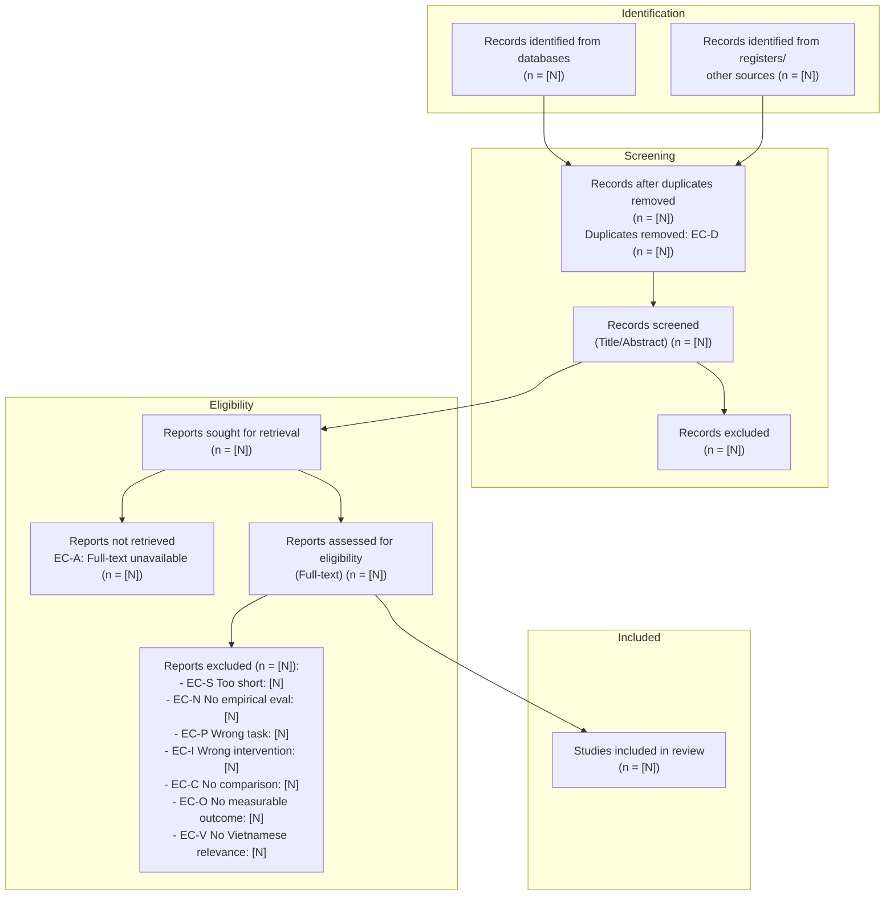

# PRISMA 2020 Flow Diagram

> **Protocol Version:** 1.0 (PRISMA 2020 Compliant)
> **Review Title:** Prompt-based LLMs vs. Fine-tuned PhoBERT for Vietnamese Scam Message Classification

---

## 1. Flow Diagram (Mermaid)

---

## 2. Stage-by-Stage Summary

### Identification

| Source                                                                                       | Count   |
| -------------------------------------------------------------------------------------------- | ------- |
| Records identified from databases (e.g., Scopus, IEEE Xplore, ACL Anthology, Google Scholar) | [N]     |
| Records identified from other sources (citation searching, registers)                        | [N]     |
| **Total records identified**                                                                 | **[N]** |

### Screening

| Step                                     | Count |
| ---------------------------------------- | ----- |
| Duplicate records removed (EC-D)         | [N]   |
| Records screened (title/abstract)        | [N]   |
| Records excluded at title/abstract stage | [N]   |

### Eligibility

| Step                                                | Count |
| --------------------------------------------------- | ----- |
| Reports sought for retrieval                        | [N]   |
| Reports not retrieved (EC-A)                        | [N]   |
| Reports assessed for eligibility (full-text review) | [N]   |
| Reports excluded, with reasons                      | [N]   |

**Exclusion reasons at full-text stage:**

| Code               | Reason                                          | Count   |
| ------------------ | ----------------------------------------------- | ------- |
| EC-S               | Fewer than 4 pages (abstract/poster)            | [N]     |
| EC-N               | No empirical evaluation (vision paper/tutorial) | [N]     |
| EC-P               | Wrong task (e.g., MT, sentiment, code)          | [N]     |
| EC-I               | Wrong intervention (not LLM/prompt-based)       | [N]     |
| EC-C               | No meaningful comparison/baseline               | [N]     |
| EC-O               | No measurable outcome                           | [N]     |
| EC-V               | No Vietnamese relevance                         | [N]     |
| **Total excluded** |                                                 | **[N]** |

### Included

| Step                                          | Count   |
| --------------------------------------------- | ------- |
| **Studies included in the systematic review** | **[N]** |

---

## 3. Notes

- Counts marked `[N]` are placeholders — replace with actual numbers once the search and screening process is completed.
- Exclusion codes reference the criteria defined in `ie_criteria.md`
- This diagram follows the standard 4-phase PRISMA 2020 flow: **Identification → Screening → Eligibility → Included**.
