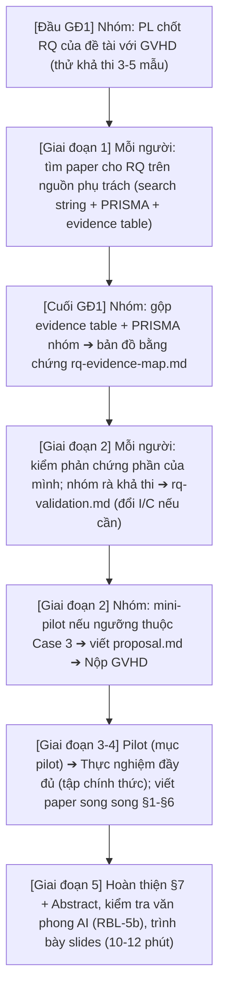

# 🗺️ RBL-0 · TỔNG QUAN CHƯƠNG TRÌNH NGHIÊN CỨU THỰC NGHIỆM

> **Đọc file này trước khi bắt đầu bất kỳ giai đoạn nào.**  
> Chương trình **Research-Based Learning (RBL)** kéo dài **5 giai đoạn (Giai đoạn 1–5)**: Mỗi nhóm thực hiện một nghiên cứu thực nghiệm gắn với đề tài để trả lời **MỘT RQ đã thống nhất với GVHD** trong tab RQ của đề tài, từ tìm tài liệu đến viết bài báo khoa học hoàn chỉnh 6–8 trang.

---

## 1. Triết lý Nghiên cứu & 5 Chặng Tổng thể

Một nghiên cứu thực nghiệm hoàn chỉnh: **Từ tài liệu đến bài báo**.  
Đánh giá một kỹ thuật, công cụ hoặc LLM trong đề tài qua 5 giai đoạn:
1. **Tìm khoảng trống từ tài liệu (GĐ1)**
2. **Chốt câu hỏi nghiên cứu và threshold trong proposal (GĐ2)**
3. **Chạy pilot (GĐ3)**
4. **Thực nghiệm đầy đủ (GĐ4)** trên dữ liệu đã đóng băng, phân tích thống kê
5. **Viết bài báo 6–8 trang** (viết song song từ GĐ3, hoàn thiện GĐ5)

> [!NOTE]
> **Kết quả âm tính vẫn là kết quả hợp lệ** nếu báo cáo trung thực. Chọn metric phù hợp với đề tài (ví dụ: precision/recall, accuracy, MAE, độ trễ) và có paper dùng làm nền.

---

## 2. Bảng 5 Sản phẩm nộp bắt buộc (D1 – D5)

| Mã | GĐ | Sản phẩm cần nộp | Đạt khi |
| :---: | :---: | :--- | :--- |
| **D1** | **GĐ1** | SLR của từng người (một nguồn), `team-synthesis/evidence-table-merged.md`, `prisma-team.md`, `rq-evidence-map.md` | Số PRISMA khớp CSV; gộp $\ge 12$ paper; mỗi yếu tố P/I/C/O có paper làm nền. |
| **D2** | **GĐ2** | `SLR/rq-check.md` của từng người, `team-synthesis/rq-validation.md`, `team-synthesis/proposal.md`, `presentation/slides_proposal.pdf` | GVHD duyệt hết Giai đoạn 2; RQ đủ P/I/C/O; $H_0/H_1$ khớp kiểm định; ngưỡng có nguồn. |
| **D3** | **GĐ3** | Pilot (`data/pilot_sample.csv`, `results/pilot_*`, `notes.md`) + bản thảo `paper/sections/01-03` | Output rỗng $\le 20\%$; IAA đạt ngưỡng nếu có gán nhãn ($\kappa \ge 0.7$). |
| **D4** | **GĐ4** | `results/full_llm_output.csv`, `results/full_api_log.txt`, `results/full_analysis.ipynb`, `summary.csv`, `figures/` + bản thảo `paper/sections/04-06` | Notebook chạy lại được (Restart & Run All); số liệu §4 khớp notebook. |
| **D5** | **GĐ5** | `paper/output/paper_final.pdf` + LaTeX source, `presentation/slides_final.pptx` + `.pdf`, `paper/quality/ai_check_log.md`, repo GitHub đầy đủ | Số liệu nhất quán giữa Abstract - §4 - §5; repo sạch và tái lập được; 6–8 trang (không tính References). |

---

## 3. Phân công 5 Vai trò trong Nhóm

*(Nhóm 4 người: PL kiêm RW; Nhóm 3 người: PL kiêm RW và DG)*

| Ký hiệu | Vai trò | Trách nhiệm chính |
| :---: | :--- | :--- |
| **PL** | **Project Lead** | Điều phối timeline, nộp GVHD, xử lý blocker; viết **Abstract** và **Discussion (§5)**. |
| **DG** | **Data & Ground Truth** | Tải dataset, tạo nhãn (ground truth), tính độ đồng thuận giữa người gán nhãn (IAA); viết **Related Work (§2)**. |
| **LR** | **LLM Runner** | Cài API, viết script chạy thực nghiệm, log chi phí; viết phần **Dataset & Pipeline (§3.1–§3.2)**. |
| **MS** | **Metrics & Stats** | Cài metric, chạy kiểm định thống kê, tính effect size; viết **Results (§4)**. Không kiêm LR. |
| **RW** | **Report Writer** | Viết **Introduction (§1)**, **Threats to Validity (§6)**, **Conclusion (§7)**; làm figures $\ge 300\text{ DPI}$ và định dạng tài liệu. |

> [!CRITICAL]
> **Quy tắc bắt buộc: $\text{LR} \neq \text{MS}$**  
> Người chạy thực nghiệm (**LR**) **không tự kiểm tra kết quả của mình** (**MS**). Không gộp LR và MS dù nhóm bao nhiêu người.

---

## 4. Sáu Nguyên tắc Sống còn (Không được vi phạm)

1. 📂 **Evidence-based**: Mọi quyết định trỏ vào một cột cụ thể của *evidence table*. Không viết *"vì GPT-4o tốt"*.
2. 🚫 **No HARKing**: RQ, metric, threshold chốt trong *proposal*; đổi sau khi thấy dữ liệu phải có *amendment* được duyệt trước. Phân tích thêm phải gắn nhãn **exploratory**.
3. 🔁 **Reproducibility**: Ghi rõ model version, hyperparameter, prompt nguyên văn, dataset, cách tải và số lần chạy lặp.
4. 🧪 **Pilot bắt buộc**: Chạy thử trên mục pilot (5–10 mẫu) trước khi chạy tập chính thức.
5. ⚠️ **Empty = INVALID**: Không tự điền kết quả *"nghe hợp lý"*; tính riêng tỷ lệ `INVALID`.
6. 🔒 **$\text{LR} \neq \text{MS}$**: Người chạy thực nghiệm không tự kiểm tra kết quả của mình; không có ngoại lệ.

---

## 5. Bảng Thuật ngữ Cốt lõi Hay gặp

| Thuật ngữ | Nghĩa | Gặp ở |
| :--- | :--- | :--- |
| **RQ (Research Question)** | Câu hỏi nghiên cứu nhóm phải trả lời bằng thực nghiệm; xây một RQ từ đề tài. | Mọi file |
| **PICO (P, I, C, O)** | Bốn mảnh của một RQ: **P**opulation (dữ liệu, task), **I**ntervention (kỹ thuật, công cụ, model), **C**omparison (so với cái gì), **O**utcome (đo bằng metric nào). | RBL-1, RBL-2 |
| **$H_0 / H_1$** | Giả thuyết không ($H_0$: không khác biệt / không đạt ngưỡng) và giả thuyết đối ($H_1$: có khác biệt / đạt ngưỡng). Kiểm định thống kê quyết định có bác bỏ $H_0$ hay không. | RBL-3, RBL-4 |
| **SLR (Systematic Literature Review)** | Tổng quan tài liệu có hệ thống: tìm, lọc, trích xuất theo quy trình ghi lại được. Luận văn làm bản rút gọn. | RBL-1 |
| **Search string** | Chuỗi truy vấn dạng `(P) AND (I) AND (O)`, dán vào CSDL như IEEE Xplore, ACM DL, Scopus, Google Scholar. | RBL-1 |
| **IC / EC** | Tiêu chí nhận / loại paper (Inclusion / Exclusion Criteria), có mã (`IC-L`, `EC-O`...) để ghi lý do cho từng quyết định. | RBL-1 |
| **Dedup** | Bỏ bản trùng (cùng DOI, hoặc cùng tên + tác giả + năm) trước khi lọc. | RBL-1 |
| **Screening (V1, V2)** | Hai vòng lọc: V1 đọc tiêu đề + abstract, V2 đọc toàn văn (full-text). Mỗi paper ghi `INCLUDE` / `EXCLUDE` / `UNSURE` kèm mã lý do. | RBL-1 |
| **PRISMA** | Chuẩn báo cáo quá trình lọc: sơ đồ số paper qua từng bước (tìm được $\rightarrow$ bỏ trùng $\rightarrow$ loại V1 $\rightarrow$ loại V2 $\rightarrow$ giữ lại). Số trong sơ đồ phải khớp số dòng CSV. | RBL-1 |
| **Snowballing** | Tìm paper theo đường trích dẫn: *backward* = paper mà seed trích dẫn (cũ hơn), *forward* = paper trích dẫn seed (mới hơn). | RBL-1 A2b |
| **Evidence table** | Bảng trích xuất, mỗi paper một dòng: Tool/LLM, Dataset, Metric, Kết quả, Hạn chế, Mức gần RQ. | RBL-1, RBL-2 |
| **Evidence map (`rq-evidence-map.md`)** | Bản đồ bằng chứng: mỗi yếu tố P, I, C, O của RQ có paper nào làm nền, còn thiếu gì. | RBL-1 B2 |
| **Phản chứng** | Paper đã trả lời đúng RQ của nhóm. Giống 4/4 PICO $\rightarrow$ **replication** (tái hiện); giống 3/4 $\rightarrow$ **extension** (mở rộng). | RBL-2 |
| **Gap (Khoảng trống)** | Điều các paper chưa làm mà RQ lấp vào: `GAP-T` (công cụ), `GAP-M` (khía cạnh đo), `GAP-D` (dữ liệu), `GAP-S` (hạn chế chung). | RBL-2, RBL-3 |
| **Proposal** | Đề cương nghiên cứu 8 mục; RQ, metric, threshold chốt ở đây và GVHD duyệt trước khi chạy thực nghiệm. | RBL-3 |
| **Baseline** | Đối chứng để so (chữ **C** trong PICO): công cụ cũ, model khác, hoặc cách làm không có can thiệp AI. | RBL-3 |
| **Metric** | Thước đo cụ thể (F1, Scam Recall, mutation score, cosine similarity...), không ghi chung chung *"accuracy"*. | RBL-1 $\rightarrow$ RBL-4 |
| **Threshold ($\theta$)** | Ngưỡng coi là *"đạt"*, lấy từ paper (Case 1, 2) hoặc từ mini-pilot (Case 3); chốt trước khi chạy tập chính thức. | RBL-3 |
| **Pilot** | Chạy thử cả quy trình trên 5–10 **mục pilot** để bắt lỗi kỹ thuật; kết quả pilot không đưa vào paper. | RBL-4 |
| **Tập chính thức** | Phần dữ liệu không trùng với mục pilot, niêm phong tới Giai đoạn 4 và chỉ mở một lần (một đợt chạy theo đúng protocol). | RBL-1, RBL-4 |
| **Ground truth** | Đáp án đúng để so output của công cụ/LLM: có sẵn trong dataset hoặc do nhóm gán nhãn. | RBL-4 |
| **IAA (Cohen's $\kappa$)** | Độ đồng thuận giữa hai người gán nhãn (Inter-Annotator Agreement); $\kappa \ge 0.8$ tốt, $0.7–0.8$ chấp nhận được, $< 0.7$ phải làm rõ hướng dẫn rồi gán lại. | RBL-0, RBL-4 |
| **INVALID** | Output rỗng hoặc lỗi API: ghi là `INVALID` và đếm riêng, không tự điền số hợp lý. | RBL-4 |
| **$p$-value, Effect size** | $p$-value: xác suất thu được kết quả ít nhất cực đoan như dữ liệu quan sát nếu $H_0$ đúng; effect size: chênh lệch lớn tới mức nào (Cliff's $\delta$, rank-biserial $r$, Cohen's $d$). Luôn báo cả hai. | RBL-0, RBL-4 |
| **HARKing** | *Hypothesizing After Results are Known*: đổi RQ, metric hoặc ngưỡng sau khi đã thấy kết quả. **Bị cấm tuyệt đối.** | RBL-0, RBL-3 |
| **Exploratory** | Phân tích thêm ngoài kế hoạch; được làm nhưng phải gắn nhãn này và không dùng để đổi kết luận của RQ. | RBL-0 |
| **Amendment** | Văn bản xin đổi thiết kế đã duyệt trong proposal ($N$, model, metric...), GVHD duyệt rồi mới làm tiếp. | RBL-3 |
| **Downscope** | Thu hẹp phạm vi khi gặp rủi ro (bỏ RQ2, giảm $N$, đổi model nhỏ hơn) theo bảng Downscope Protocol. | RBL-0 |
| **§** | Ký hiệu mục: ví dụ $\S 3 =$ Mục 3 của proposal hoặc bài báo. | Mọi file |

---

## 6. Luồng Công việc & Timeline Tổng thể

### Các Mốc Hạn Chót Cốt Lõi (Hard Deadlines):
* ⚠️ **GVHD chốt RQ**: Đầu Giai đoạn 2 (đổi I/C phải xong trước mốc này).
* 🚨 **Hạn duyệt Proposal**: Hết Giai đoạn 2 (trễ $\rightarrow$ Kích hoạt *Downscope Protocol* chỉ làm RQ1).
* ⏱️ **Ước tính khối lượng mỗi người**:
  * GĐ1: ~10–12 giờ
  * GĐ2: ~12–14 giờ
  * GĐ3 & GĐ4: ~10–12 giờ
  * GĐ5: ~10 giờ
  *(Không dồn việc về cuối giai đoạn).*
