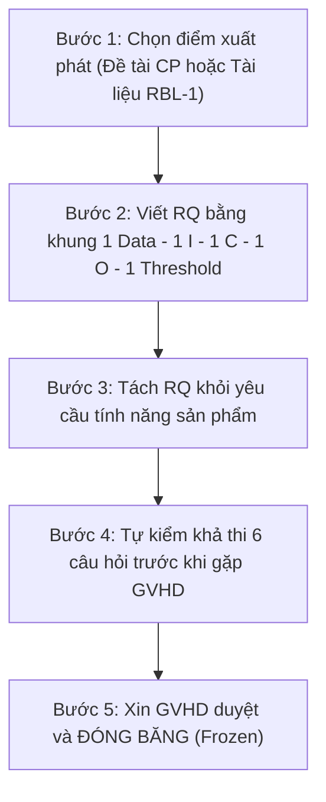

# 🎯 XÂY DỰNG CÂU HỎI NGHIÊN CỨU (RQ) CHO ĐỀ TÀI LUẬN VĂN

> **Nguyên tắc cốt lõi:** Danh sách RQ duyệt sẵn chỉ dành cho lớp môn học. Với luận văn (Capstone), nhóm **tự xây RQ từ đề tài hoặc từ khoảng trống tìm được trong tài liệu**, rồi trình GVHD phê duyệt.

---

## 1. Quy Trình Xây RQ 5 Bước Chuẩn Mực

### Bước 1: Chọn Điểm Xuất Phát
* **(a) Từ đề tài Capstone:** Chọn một thành phần của sản phẩm có đầu ra đo được (ví dụ: mô-đun gợi ý, phân loại spam/scam, trích xuất thông tin, sinh test case, phát hiện lỗi) — *không lấy cả hệ thống lớn*.
* **(b) Từ tài liệu (SLR):** Đọc 5–10 bài gần nhất cùng chủ đề (RBL-1), ghi lại điều các bài chưa trả lời.
* 🎯 **Điểm giao thoa lý tưởng:** Thành phần của sản phẩm trùng đúng với khoảng trống (*Gap*) trong tài liệu.

### Bước 2: Viết RQ Bằng Khung Chuẩn
* Đủ **1 Dữ liệu** – **1 Can thiệp** – **1 Đối chứng (Baseline)** – **1 Chỉ số (Metric)** – **1 Ngưỡng có nguồn (Threshold)**.
* **Can thiệp ($I$):** Phương án kỹ thuật/mô hình nhóm định đưa vào sản phẩm.
* **Baseline ($C$):** Cách đang dùng hoặc cách đơn giản nhất (rule-based, công cụ có sẵn, không dùng AI, human baseline).

### Bước 3: Tách RQ Khỏi Yêu Cầu Sản Phẩm
* RQ hỏi: *"Phương án nào tốt hơn, hơn bao nhiêu, trên dữ liệu nào?"* — **không hỏi** *"Đã làm được tính năng X chưa?"*.
* Kết quả RQ quyết định phương án đưa vào sản phẩm; ghi sẵn phương án dự phòng nếu kết quả âm tính hoặc không kết luận được.

### Bước 4: Tự Kiểm Khả Thi Trước Khi Gặp GVHD (Làm Thử Thật, Không Đoán)

| # | Câu hỏi kiểm tra | Làm thử thế nào | Nếu "Không" $\rightarrow$ Đối sách xử lý |
| :-: | :--- | :--- | :--- |
| **1** | **Dữ liệu có sẵn, được phép dùng, đủ số mục?** | Xác định nguồn (dataset công khai có license, hoặc văn bản đồng ý); dữ liệu cá nhân phải ẩn danh trước; đếm số mục đúng tiêu chí; ghi phiên bản. | ❌ **Đổi dữ liệu hoặc thu hẹp RQ** |
| **2** | **Công cụ đo chạy được trên máy nhóm?** | Cài, build, chạy trên 1 mục (thư viện metric, công cụ đánh giá, môi trường sản phẩm). | ❌ **Đổi công cụ** |
| **3** | **LLM/API dùng được và đủ tiền?** | Chạy 1 lần trên 1 mục; ước tính chi phí = $\text{Số mục} \times \text{Số lần chạy} \times \text{Chi phí 1 lần}$. | ❌ **Giảm cỡ mẫu $N$ hoặc đổi model** |
| **4** | **Chỉ số tính được?** | Tính thử trên output của câu 3; nếu cần gán nhãn tay: 2 người gán độc lập, đo mức đồng thuận IAA. | ⚠️ **Hỏi GVHD** |
| **5** | **Tài liệu đủ để viết?** | Chạy search string ở 1 cơ sở dữ liệu, lướt tiêu đề: có $\ge 12$ bài gần chủ đề? | ⚠️ **Hỏi GVHD** |
| **6** | **Thời gian đủ cùng với phần sản phẩm?** | Đặt thực nghiệm vào kế hoạch: pilot, chạy đầy đủ, phân tích, viết bài. | ❌ **Thu hẹp dữ liệu hoặc can thiệp** |

> *Ghi kết quả 6 câu này vào `notes.md` để dùng lại ở RBL-2.*

### Bước 5: Xin Duyệt và Đóng Băng (Frozen)
* Gửi GVHD câu RQ + cặp giả thuyết $H_0/H_1$ + kết quả 6 câu tự kiểm.
* Sau khi duyệt, ghi phiên bản dữ liệu, cấu hình, seed vào proposal (RBL-3) trước khi chạy thực nghiệm; đổi RQ sau khi đã duyệt phải ghi lý do (*Deviation / Amendment*).

---

## 2. Khung Soạn Câu Hỏi Nghiên Cứu & Bộ Kiểm Tra Nhanh (0/6 Checklist)

### 7 Thành Phần Bắt Buộc Của RQ:

1. **Đối tượng nghiên cứu (Artifact / Task):**  
   *Ví dụ:* Mô-đun phân loại tin nhắn lừa đảo và mạo danh tiếng Việt trong nền tảng ScamShield-VN.
2. **Can thiệp ($I$ – Kỹ thuật, công cụ hoặc LLM; phiên bản, cấu hình):**  
   *Ví dụ:* ViSoBERT kết hợp Cost-Sensitive Weighted Binary Cross-Entropy loss ($\mathcal{L}_{\text{WBCE}}$ với $\alpha=5.0$, ONNX INT8).
3. **Baseline ($C$ – So sánh với gì):**  
   *Ví dụ:* PhoBERT-base-v2, FPT ViBERT-base, PhoBERT-large (370M), và Gemini 3.5 Flash (5-shot In-Context Learning).
4. **Chỉ số kết quả ($O$ – Một chỉ số duy nhất):**  
   *Ví dụ:* Scam Recall (hoặc F1-Score trên nhãn lừa đảo).
5. **Dữ liệu ($P$ – Phiên bản, kích thước):**  
   *Ví dụ:* Bộ dữ liệu $2.665$ tin nhắn SMS tiếng Việt chuẩn hóa, tập Frozen Test Set niêm phong $N=267$ mẫu (192 Ham, 75 Scam).
6. **Ngưỡng cần đạt (Threshold $\theta$):**  
   *Ví dụ:* Scam Recall $\ge 95.0\%$ (hoặc chênh lệch $\Delta \text{Recall} \ge +3.0\%$ so với baseline mạnh nhất).
7. **Nguồn của ngưỡng:**  
   *Ví dụ:* Case 1 (Trích dẫn paper nền) / Case 2 (Trung vị các nghiên cứu) / Case 3 (Kết quả mini-pilot 5–10 mẫu).

---

## 3. Công Thức Phát Biểu RQ & Cặp Giả Thuyết Chuẩn Học Thuật

### Công Thức Tổng Quát:

$$\text{\textbf{Có đối chứng:}}\quad \text{"Với [Dataset P], [Can thiệp I] khác [Đối chứng C] thế nào về [Một Metric O]?"}$$

$$\text{\textbf{Không đối chứng:}}\quad \text{"Với [Dataset P], [Can thiệp I] có đạt [Metric O] } \ge \text{[Ngưỡng } \theta \text{] không?"}$$

### Bảng Ánh Xạ $H_0 / H_1$ và Kiểm Định Thống Kê:

| Loại RQ | Giả thuyết không ($H_0$) | Giả thuyết đối ($H_1$) | Kiểm định gợi ý |
| :--- | :--- | :--- | :--- |
| **So sánh 2 điều kiện (Có C)** | $\text{Metric}(I) = \text{Metric}(C)$ *(không khác biệt)* | $\text{Metric}(I) \neq \text{Metric}(C)$ *(có khác biệt)* | Cùng các mục: **McNemar** (đúng/sai), **Wilcoxon signed-rank ghép cặp** (điểm liên tục). Khác nhau: **Mann-Whitney U**. |
| **So sánh $\ge 3$ điều kiện** | $\text{Metric}$ không khác nhau giữa các điều kiện | Ít nhất một cặp có khác biệt | **Cochran's Q** (đúng/sai) hoặc **Friedman test** (điểm liên tục), rồi so từng cặp có hiệu chỉnh Holm. |
| **Ngưỡng tuyệt đối (Không C)** | $[I]$ KHÔNG đạt $\text{Metric} \ge \theta$ | $[I]$ ĐẠT $\text{Metric} \ge \theta$ | **Binomial exact một phía** (tỷ lệ), **Wilcoxon 1 mẫu** (điểm liên tục). |

---

## 4. Bộ Kiểm Tra 6 Tiêu Chí (0/6 Checklist)

- [ ] **1. Có đối tượng và tác vụ cụ thể:** Nêu rõ loại artifact / tác vụ và hệ thống.
- [ ] **2. Có can thiệp cụ thể (kỹ thuật/công cụ/LLM):** Nêu rõ tên kỹ thuật, phiên bản, cấu hình.
- [ ] **3. Có baseline rõ ràng:** Chọn baseline đối chứng minh bạch (ưu tiên human baseline hoặc mô hình tiêu chuẩn).
- [ ] **4. Đúng MỘT metric:** Chọn đúng 1 metric chủ đạo; nhiều metric làm RQ bị loãng.
- [ ] **5. Dữ liệu có phiên bản/kích thước:** Nêu rõ nguồn dữ liệu, phiên bản và số lượng $N$.
- [ ] **6. Threshold có số và có nguồn:** Cả con số cụ thể và nguồn xuất xứ (Case 1/2/3). Tuyệt đối không tự đặt *"cho hợp lý"*.
