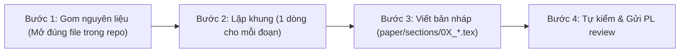
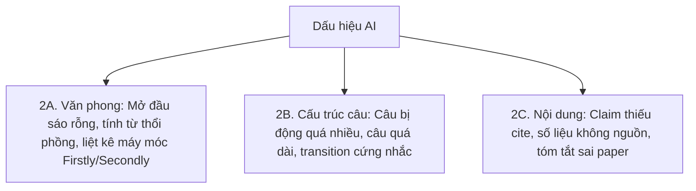

# ✍️ CẨM NANG HƯỚNG DẪN VIẾT BÀI BÁO KHOA HỌC (GIAI ĐOẠN 3 – 5)

> **Mục tiêu:** Hướng dẫn từng bước cách viết một bài báo khoa học 6–8 trang chuẩn quốc tế (IEEE / ACM / Springer), từ xây dựng dàn ý, trích dẫn số liệu thực chứng, đến kiểm soát văn phong và liêm chính học thuật.

---

## 1. Quy Trình 4 Bước Viết Mỗi Section & Quy Tắc Chung



### 6 Quy Tắc Vàng Toàn Bài Báo:
1. **Mỗi đoạn một ý**, câu đầu tiên luôn là câu chủ đề (*Topic sentence*).
2. **Quy tắc chia thì:**
   * **Thì quá khứ (*Past tense*)** cho việc nhóm đã làm: *"We trained..."*, *"We excluded..."*, *"We evaluated..."*.
   * **Thì hiện tại (*Present tense*)** cho điều Bảng/Hình đang thể hiện: *"Table 2 shows..."*, *"Figure 3 illustrates..."*.
3. **Mọi khẳng định phải có điểm tựa:** Hoặc trích dẫn `\cite{}`, hoặc số liệu thực nghiệm của nhóm, hoặc tham chiếu Bảng/Hình.
4. **Số liệu luôn kèm cỡ mẫu $N$ và đơn vị đo lường.**
5. **Tuyệt đối không lạm dụng từ thổi phồng:** Không dùng *"significantly"*, *"novel"*, *"groundbreaking"*, *"state-of-the-art"* nếu chưa có kiểm định thống kê $p < 0.05$ hoặc nguồn chứng minh rõ ràng.
6. **Khung Claim $\rightarrow$ Evidence $\rightarrow$ Warrant (`paper/claims.md`):**
   * **Claim:** Khẳng định nhóm đưa ra.
   * **Evidence:** Số liệu, bảng kết quả hoặc trích dẫn trực tiếp.
   * **Warrant:** Lập luận giải thích vì sao evidence đó đủ chứng minh cho claim (giới hạn phạm vi dữ liệu).

---

## 2. Thiết Lập Bản Thảo LaTeX Trên Overleaf (`main.tex`)

```latex
\documentclass[conference]{IEEEtran}
\usepackage[utf8]{inputenc}
\usepackage{graphicx}
\usepackage{booktabs}
\usepackage{hyperref}

\begin{document}
\title{ScamShield-VN: Evidence-Grounded Vietnamese Scam and Phishing Detection Platform}
\author{\IEEEauthorblockN{Author 1, Author 2, Author 3, Author 4, Author 5}
\IEEEauthorblockA{FPT University, Vietnam}}
\maketitle

\begin{abstract}
\input{sections/00_abstract}
\end{abstract}

\begin{IEEEkeywords}
scam detection, phishing detection, large language models, cost-sensitive learning, natural language processing
\end{IEEEkeywords}

\input{sections/01_intro}
\input{sections/02_related}
\input{sections/03_method}
\input{sections/04_results}
\input{sections/05_discussion}
\input{sections/06_threats}
\input{sections/07_conclusion}

\bibliographystyle{IEEEtran}
\bibliography{references}
\end{document}
```

---

## 3. Hướng Dẫn Chi Tiết Từng Section

### §1 Introduction (RW, ~1 trang — Viết ở Giai đoạn 3)
* **Nguyên liệu:** `team-synthesis/evidence-table-merged.md`, `rq-validation.md`, `proposal.md` $\S 2, \S 4$.
* **Cấu trúc chuẩn 5 đoạn:**
  1. **Đoạn 1 (Vấn đề thực tế):** Đặt vấn đề thực tiễn đang tốn kém/nguy hiểm ở đâu (*"Writing [X] manually is time-consuming and error-prone..."*).
  2. **Đoạn 2 (State of the art):** Cộng đồng nghiên cứu đã làm được gì (2–3 hướng lớn, có trích dẫn `\cite{}`).
  3. **Đoạn 3 (GAP):** Điều cụ thể còn thiếu và vì sao thiếu sót đó quan trọng (*"However, in the studies we reviewed, none evaluates..."*).
  4. **Đoạn 4 (Contribution):** Nhóm làm gì để giải quyết (dạng gạch đầu dòng: đánh giá thực nghiệm $I$ cho task $P$, kết quả chính 1 dòng, dữ liệu/mã nguồn công khai).
  5. **Đoạn 5 (Cấu trúc bài báo):** Giới thiệu các phần tiếp theo (*"The rest of this paper is structured as follows..."*).

| ❌ Chưa tốt | ✔️ Tốt hơn (Chuẩn học thuật) |
| :--- | :--- |
| *"Artificial intelligence is increasingly used in software engineering. Many studies show that LLMs are powerful. However, there are still few studies on test generation. In this paper, we propose a novel approach to evaluate LLMs. The results are promising."* | **[1. Vấn đề]** *"Writing unit tests by hand takes about [X]% of developer time [A]."*<br>**[2. State of the art]** *"Recent studies [B, C, D] use LLMs to generate unit tests and report line coverage between 55% and 80%."*<br>**[3. GAP]** *"However, none of them reports mutation score for Java functions with branching logic, so fault-detection ability remains unclear."*<br>**[4. Contribution]** *"We compare GPT-4o mini with EvoSuite on 200 functions from [dataset] using mutation score."*<br>**[5. Cấu trúc]** *"Section 2 reviews related work..."* |

---

### §2 Related Work (DG, ~1–1.5 trang — Viết ở Giai đoạn 3)
* **Nguyên liệu:** `evidence-table-merged.md`, `rq-validation.md`.
* **Cách viết theo 4 bước:**
  1. **Gom theo 2–3 Theme khoa học:** Mỗi theme 4–6 paper (ví dụ: Theme A *"Language Models for Phishing Detection"*, Theme B *"Cost-Sensitive Learning in Imbalanced Text Classification"*).
  2. **Viết mỗi theme 3 câu:** (a) Các nghiên cứu này làm gì nhìn chung; (b) Họ tìm thấy gì (kèm 1–2 con số có nguồn); (c) **Hạn chế chung** của nhóm này.
  3. **Bảng tổng hợp đối sánh:** Cột Paper | Tool/LLM | Metric | Dataset | Kết quả chính.
  4. **Đoạn định vị cuối section:** *"Unlike prior work, this paper [gap statement]."* (Khớp chính xác với GAP ở $\S 1$).

---

### §3 Methodology (LR + MS, ~1.5–2 trang — Viết ở Giai đoạn 3)
* **Nguyên liệu:** `proposal.md` $\S 5.1–\S 5.4$, `scripts/`, `results/pilot_api_log.txt`.
* **Phân chia trách nhiệm:**
  * **3.1 Dataset (LR):** Tên dataset, URL, commit/phiên bản, license, kích thước $N$, tiêu chí lọc, số lượng bị loại, thống kê mô tả, trích dẫn bài báo gốc của dataset, checksum ngày tải.
  * **3.2 Setup / Pipeline (LR):** Tên model chính xác (vd: `gpt-4o-mini-2024-07-18`, `visobert-base`), temperature, top_p, max_tokens, số lần chạy lặp $K$, prompt nguyên văn trong Appendix, các bước pipeline từ input đến output, xử lý empty response và rate limit.
  * **3.3 Metrics (MS):** Tên metric, công thức toán học, thư viện + version, threshold và nguồn gốc (Case 1/2/3).
  * **3.4 Statistical Analysis (MS):** Kiểm định thống kê đã chọn, mức $\alpha = 0.05$, phương pháp hiệu chỉnh đa kiểm định (Holm/Bonferroni), thước đo Effect Size và thang phân loại.

---

### §4 Results (MS, ~1–1.5 trang — Viết ở Giai đoạn 4)
* **Nguyên liệu:** `results/full_analysis.ipynb`, `results/summary.csv`, `figures/`.
* **Quy tắc bất biến:** **Chỉ báo số liệu, tuyệt đối KHÔNG giải thích nguyên nhân ở $\S 4$** (nguyên nhân để sang $\S 5$).
* **Cấu trúc 4 bước trình bày mỗi RQ:**
  1. Nêu RQ và $H_0/H_1$ nguyên văn từ proposal.
  2. Thống kê mô tả: Trung vị và IQR (hoặc Mean $\pm$ Std nếu phân phối chuẩn), kèm $N$ thực tế sau khi bỏ invalid.
  3. Kiểm định: Tên kiểm định, $p$-value chính xác (vd: $p = 0.007$, không viết chung chung $p < 0.05$), effect size và nhãn mức độ, **Khoảng tin cậy $95\%\text{ CI}$**, kết luận bác bỏ hay không bác bỏ $H_0$.
  4. Tham chiếu Bảng X và Hình Y.

| ❌ Chưa tốt | ✔️ Tốt hơn (Chuẩn học thuật) |
| :--- | :--- |
| *"Approach A performed significantly better than Approach B (p < 0.05), which shows that LLMs are effective for this task."* | *"For RQ1, Approach A reached a median of 0.84 (IQR 0.78–0.90, N = 197 of 200 functions; each function run K = 3 times and summarised by its median; 49 of 600 responses (8.2%) were invalid). Compared with Approach B, the difference was statistically significant (paired Wilcoxon, p = 0.007) with a medium effect (paired rank-biserial r = 0.38; median paired difference 0.11, 95% CI 0.05–0.17), so we reject H0."* |

---

### §5 Discussion (PL + MS, ~1 trang — Viết ở Giai đoạn 4)
* **Nguyên liệu:** $\S 4$ (đã chốt), `evidence-table-merged.md`, mẫu 10–20 case sai sót từ `results/full_llm_output.csv`.
* **4 Mục thảo luận cốt lõi:**
  * **5.1 Giải thích finding chính:** Đào sâu vào 10–20 case sai nhiều nhất, gán nhãn nguyên nhân kỹ thuật, lập bảng tần suất lỗi.
  * **5.2 So sánh với Prior Work:** Cao hơn, thấp hơn hay tương đồng với paper trong evidence table? Vì sao (khác dataset, prompt, hay model capacity)?
  * **5.3 Implications:** Khi nào nên dùng giải pháp này? Khuyến nghị thực tiễn cho developer và nhà nghiên cứu.
  * **5.4 Kết quả bất ngờ:** Các hiện tượng ngoài dự đoán và giả thuyết lý giải.

---

### §6 Threats to Validity (RW, ~0.5–1 trang — Viết ở Giai đoạn 4)
Mỗi loại threat phải có đủ **3 phần:** Nó là gì $\rightarrow$ Ảnh hưởng gì $\rightarrow$ **Nhóm đã làm gì cụ thể để giảm thiểu (*Mitigation action*)**:
1. **Internal Validity:** Yếu tố bên trong thí nghiệm (vd: tính không tất định của LLM $\rightarrow$ *Mitigation:* Cố định seed, đặt temperature = 0, chạy lặp $K=3$ lần và lấy trung vị).
2. **External Validity:** Khả năng tổng quát hóa (vd: chỉ thử trên SMS tiếng Việt $\rightarrow$ *Mitigation:* Nêu rõ phạm vi, cảnh báo không khái quát hóa trực tiếp cho email tiếng Anh).
3. **Construct Validity:** Thước đo có phản ánh đúng bản chất (vd: rủi ro data contamination $\rightarrow$ *Mitigation:* Kiểm tra đối chiếu mẫu benchmark với dữ liệu huấn luyện mở).
4. **Conclusion Validity:** Kiểm định có phù hợp và đủ mạnh (vd: cỡ mẫu phân nhóm nhỏ $\rightarrow$ *Mitigation:* Báo kèm effect size và khoảng tin cậy $95\%$).

---

### §7 Conclusion (RW, ~0.5 trang — Viết ở Giai đoạn 5)
1. **Đoạn 1:** Tóm tắt trả lời RQ trong 1–2 câu kèm kết quả số thực chứng ($p$-value, effect size).
2. **Đoạn 2:** Khẳng định đóng góp nổi bật nhất và một giới hạn chính.
3. **Đoạn 3:** 2–3 hướng *Future Work* cụ thể, khả thi (vd: *"Future work could evaluate the model on Vietnamese Telegram voice scam transcripts and add human baseline"*).

---

### Abstract (PL, ~150–200 từ — Viết sau cùng ở Giai đoạn 5)
* **Cấu trúc vàng 5 câu:**
  1. **Câu 1 (Context):** Vấn đề thực tế quan trọng như thế nào (kèm số liệu thực tiễn).
  2. **Câu 2 (Gap):** Các nghiên cứu trước còn thiếu sót gì cụ thể.
  3. **Câu 3 (Method):** Nhóm làm gì (dataset nào, mô hình/kỹ thuật nào).
  4. **Câu 4 (Results):** Kết quả số cụ thể (Scam Recall, F1, $p$-value, effect size).
  5. **Câu 5 (Implication):** Ý nghĩa khoa học và giá trị ứng dụng thực tiễn.

---

## 4. Chuẩn Hóa Văn Phong & Liêm Chính Chống Đạo Văn (RBL-5b)

### 3 Nhóm Dấu Hiệu Văn Bản AI Cần Loại Bỏ:



### Quy Trình 4 Bước Viết Lại Một Đoạn:
1. Đọc và hiểu ý định muốn diễn đạt, tóm tắt lại bằng **1 câu đơn giản**.
2. **Bỏ đoạn cũ**, tự viết lại từ bản tóm tắt mà không nhìn lại câu chữ cũ.
3. Bổ sung con số thực tế hoặc citation `\cite{}` cho mọi tuyên bố.
4. Đọc to thành tiếng: Nếu nghe như một nhà nghiên cứu đang trò chuyện chuyên môn $\rightarrow$ Đạt yêu cầu.
