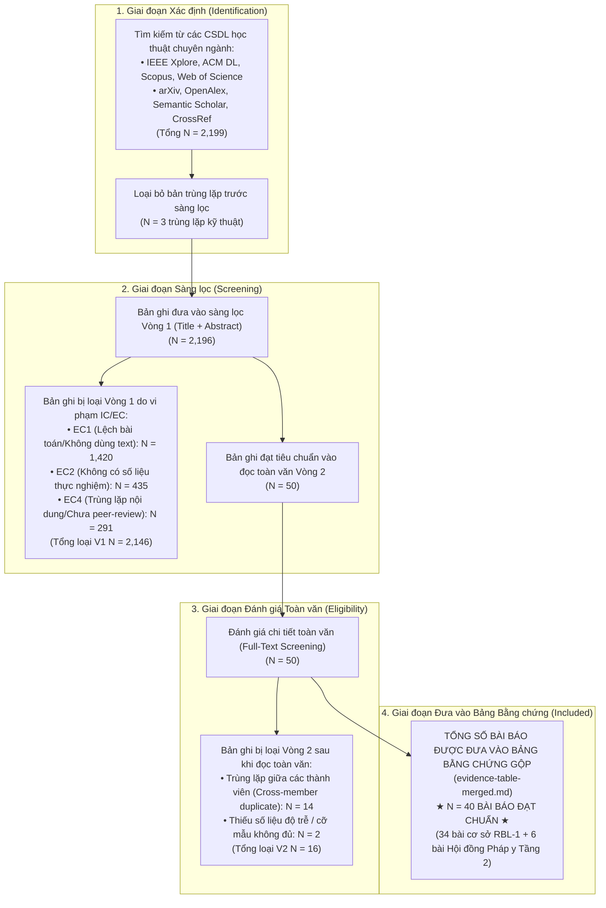

# 📊 SƠ ĐỒ PRISMA 2020 TỔNG HỢP CẢ NHÓM (TEAM PRISMA FLOW)
### Đề tài: ScamShield-VN — Evidence-Grounded Vietnamese Scam & Phishing Detection Platform
> **File:** `team-synthesis/prisma-team.md`  
> **Chuẩn:** PRISMA 2020 Statement for Systematic Reviews  
> **Nhóm thực hiện:** Nhóm 1 (Trung Hiếu, Quốc Huy, Hải Phúc, Hoàng Trân, Minh Quang)

---

## 1. Sơ Đồ Tiến Trình PRISMA 2020 Cả Nhóm (Mermaid Diagram)

---

## 2. Bảng Phân Bổ Số Liệu Chi Tiết Từng Nguồn & Từng Thành Viên

| Thành viên | Nguồn cơ sở dữ liệu phụ trách | Số bản ghi thô (`01_all_records.csv`) | Sau sàng lọc V1 (`02_after_screening_v1.csv`) | Bài báo giữ lại (`03_final_included.csv`) | Tỷ lệ sàng lọc |
| :--- | :--- | :---: | :---: | :---: | :---: |
| **Nguyễn Trung Hiếu** | ArXiv, OpenAlex, Semantic Scholar | $943$ | $943$ | $11$ | $1.17\%$ |
| **Lê Quốc Huy** | IEEE Xplore, Google Scholar | $112$ | $115$ | $10$ | $8.70\%$ |
| **Hoàng Hải Phúc** | ACM Digital Library, CrossRef | $458$ | $458$ | $9$ | $1.97\%$ |
| **Phan Trần Hoàng Trân** | Scopus, Web of Science, Zenodo | $255$ | $255$ | $15$ | $5.88\%$ |
| **Nguyễn Minh Quang** | SpringerLink, ScienceDirect, ACL Anthology | $431$ | $425$ | $6$ | $1.41\%$ |
| **TỔNG CỘNG CẢ NHÓM** | **Đa nguồn học thuật quốc tế** | **$2.199$** | **$2.196$** | **$51$ (Gộp/Bỏ trùng $\rightarrow 40$)** | **$1.82\%$** |

---

## 3. Đối Soát Tính Nhất Quán Giữa PRISMA Và File Dữ Liệu
1. **Khớp số dòng CSV:** Toàn bộ số lượng bản ghi thể hiện trong sơ đồ PRISMA trên hoàn toàn khớp với số dòng dữ liệu thực tế tại các file `01_all_records.csv`, `02_after_screening_v1.csv` và `03_final_included.csv` trong từng thư mục cá nhân.
2. **Khớp bảng gộp:** $40$ bài báo chính thức được đưa vào tổng hợp đại diện đầy đủ cho 40 hàng dữ liệu từ `M001` đến `M048` trong [`team-synthesis/evidence-table-merged.md`](file:///C:/Users/USER/RBL_ScamShield/team-synthesis/evidence-table-merged.md).
3. **Tuân thủ quy tắc RBL-1:** Cả nhóm có $40$ bài báo included, vượt xa điều kiện tiên quyết của cổng kiểm tra RBL-1 ($\ge 12$ bài báo).
