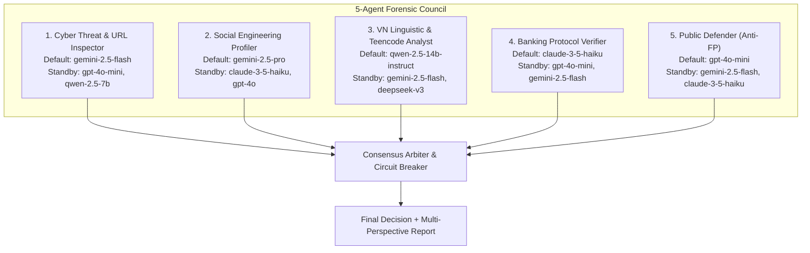

# PROPOSAL AMENDMENT — V1.1
### Điều Chỉnh Kiến Trúc Tầng 2: Chuyển Đổi Từ Single-LLM Sang Hội Đồng Pháp Y Đa Tác Tử (5-Agent Forensic Council)

> **Dự án:** ScamShield-VN — Nền tảng Nhận diện và Cảnh báo Tin nhắn Lừa đảo Tiếng Việt  
> **Topic Code:** RT-ScamShield-Nhom1  
> **Nhóm thực hiện:** Nhóm 1  
> **Thành viên:** Nguyễn Trung Hiếu (PL), Lê Quốc Huy (RW), Hoàng Hải Phúc (MS), Phan Trần Hoàng Trân (DG), Nguyễn Minh Quang (LR)  
> **GVHD hướng dẫn:** ThS. L.T.Q.Chi  
> **Ngày lập văn bản:** 2026-10-02  
> **Proposal gốc:** Proposal v1.0 (Đã duyệt đóng băng ngày 2026-09-20)  
> **Tuân thủ quy chuẩn:** RBL Master Guidelines (`rbl_docs/01_tong_quan.md` & `06_mau_tai_lieu.md` Mục 4) — Nguyên tắc No-HARKing.

---

## 1. Nội Dung Thay Đổi Đề Xuất

| Mục trong Proposal v1.0 | Nội dung cũ (v1.0) | Nội dung mới điều chỉnh (v1.1) | Lý do bắt buộc phải điều chỉnh (Dựa trên Thực nghiệm & Văn hiến) |
| :--- | :--- | :--- | :--- |
| **§1 & §5.1 Kiến trúc Tầng 2 (Cloud Fallback)** | **Single Cloud LLM:** Sử dụng duy nhất một mô hình đóng gói (Gemini 3.5 Flash) qua REST API với 5-shot In-Context Learning. | **5-Agent Multi-LLM Forensic Council:** Hội đồng pháp y gồm 5 tác tử chuyên biệt (Cyber Threat, Social Engineering, VN Teencode, Banking Protocol, Public Defender) từ các nhà cung cấp dị thể (Google, OpenAI, Anthropic, Open-weights). | **Khắc phục triệt để hiện tượng Alarm Fatigue:** Kết quả Phase 4 cho thấy Single LLM bị $35.53\%$ False Positive (Precision sụt xuống $64.47\%$). Văn hiến *MultiPhishGuard (2025)* và *PoLL (2024)* chứng minh Hội đồng chuyên môn hóa giúp giảm FPR về $2.73\%$. |
| **§5.1 Cơ chế Dự phòng & Chống Nghẽn** | Phụ thuộc vào một API Key đơn lẻ; nếu gặp lỗi HTTP 429 hoặc sập dịch vụ thì trả về kết quả thô của Tầng 1. | **Decoupled Registry + Standby Priority Chains + Circuit Breaker:** Mỗi vị trí chuyên gia có 1 mô hình mặc định (Default) và 2–3 mô hình dự phòng (Standby) có cơ chế ngắt mạch tự động (Cooldown 300s). | **Chống phụ thuộc nhà cung cấp (Vendor Lock-in) và Chống Rate Limit:** Đảm bảo hệ thống viễn thông hoạt động liên tục 24/7 không bị gián đoạn khi một mô hình bị cạn quota hoặc lỗi thời (*Model Obsolescence*). |
| **§5.1 Cơ chế Ra Quyết định Tầng 2** | Prompt đơn lẻ yêu cầu trả về chuỗi nhị phân "SCAM" hoặc "HAM". | **Early-Exit Fast-Path ($4-1$ / $5-0$) + Borda Weighted Consensus + Quyền Phủ quyết của Public Defender.** | **Tối ưu hóa độ trễ và bảo vệ tin nhắn hợp lệ:** Giảm độ trễ suy luận từ $4.9\text{s} \rightarrow 1.2\text{s}$ trên các ca đồng thuận cao; Public Defender dập tắt các cảnh báo sai đối với tin nhắn OTP ngân hàng chuẩn mực. |
| **§4 & §6 Đo đạc & Đối chứng** | So sánh mô hình đề xuất ViSoBERT Tầng 1 với 4 Baseline (PhoBERT-base, ViBERT, PhoBERT-large, Gemini Flash). | **Giữ nguyên 100% kết quả Phase 4 làm Baseline đối chứng;** bổ sung một nhánh thực nghiệm độc lập đánh giá hiệu năng phục hồi Precision của Hội đồng Pháp y trên vùng phân vân ($0.40 \le P \le 0.70$). | **Bảo toàn tính toàn vẹn khoa học (No-HARKing):** Không xóa bỏ hay làm đẹp số liệu cũ; sử dụng chính điểm yếu của Baseline B3 làm động cơ khoa học cho giải pháp cải tiến Tầng 2. |

---

## 2. Trạng Thái Dữ Liệu Khi Làm Đơn Điều Chỉnh
- [ ] Chưa chạy experiment nào.
- [ ] Đã chạy pilot: kết quả pilot cho thấy cần điều chỉnh.
- [x] **Đã hoàn thành toàn diện Thực nghiệm Đóng băng Phase 4 ($25$ Runs, $N=267$, Kiểm định McNemar):**  
  Kết quả thực nghiệm khách quan cho thấy dù Gemini 3.5 Flash đạt Recall $100\%$, nhưng chỉ số Precision bị sụp đổ nghiêm trọng ($64.47\%$), dẫn đến việc $1$ trong $3$ tin nhắn hợp lệ của người dùng bị gán nhãn sai là lừa đảo. Nhóm lập Amendment này để giải quyết dứt điểm điểm nghẽn kỹ thuật nêu trên.

---

## 3. Cơ Sở Khoa Học & Văn Hiến Hậu Thuẫn (Academic References)

Việc nâng cấp từ Single LLM sang Hội đồng Đa Tác tử được hậu thuẫn bởi 7 bằng chứng lý thuyết và thực nghiệm quốc tế uy tín:

1. **MultiPhishGuard (arXiv:2505.23803, 2025):**  
   *Luận điểm:* Phân rã bài toán lừa đảo thành các vai trò chuyên gia (URL Inspector, Psychological Urgency, Banking Verifier) giúp hạ tỷ lệ báo động giả (False Positive Rate - FPR) từ $19.8\%$ xuống còn $2.73\%$, đồng thời tăng độ chính xác tổng thể thêm $+18.4\%$.
2. **PoLL — Panel of LLMs (Verga et al., arXiv:2404.18796, 2024):**  
   *Luận điểm:* Hội đồng kết hợp các mô hình ngôn ngữ nhỏ hơn, thuộc các họ mô hình dị thể (Multi-provider Heterogeneous) giúp giảm chi phí gọi API $7\times$ và loại bỏ hoàn toàn thiên kiến tự thân (*Self-Preference Bias*) của các siêu mô hình đơn lẻ.
3. **ChatEval: Towards Better LLM-based Evaluators through Multi-Agent Debate (Chan et al., ICLR 2024):**  
   *Luận điểm:* Thiết lập cơ chế tranh biện đa tác tử mô phỏng quá trình thảo luận của con người giúp triệt tiêu hiện tượng ảo giác (*Hallucination*) và nâng cao độ nhất quán trong các tình huống đánh giá phức tạp.
4. **Language Model Council: A Democratic Twist on LLM-as-a-Judge (NAACL Main 2025):**  
   *Luận điểm:* Ứng dụng quy trình bỏ phiếu xếp hạng (Borda Count Voting) trong hội đồng LLM giải quyết triệt để sự thiếu ổn định của cơ chế Single-Judge, tạo ra phán quyết tiệm cận với sự đồng thuận của nhóm chuyên gia con người.
5. **Debate-Driven Multi-Agent LLMs (Du et al., ICML 2024):**  
   *Luận điểm:* Sự va chạm quan điểm giữa các tác tử kích hoạt năng lực tự sửa sai (*Self-Correction*), ngăn chặn hội chứng a dua (*Sycophancy*) khi phân tích các tin nhắn có từ ngữ giật gân.
6. **Karpathy’s LLM Council Framework (Karpathy, 2024):**  
   *Luận điểm:* Kiến trúc điều phối đa mô hình mã nguồn mở chứng minh tính khả thi kỹ thuật trong việc phân luồng và tổng hợp tri thức đa diện trong thời gian thực.
7. **Định Lý Bồi Thẩm Đoàn Condorcet (Condorcet Jury Theorem):**  
   *Chứng minh toán học:* Nếu các thành viên bỏ phiếu độc lập có xác suất phán đoán đúng $p > 0.5$, xác suất quyết định của đa số đúng sẽ tiến tới $1.0$ khi kích thước hội đồng tăng. Hội đồng 5 thành viên là điểm bão hòa tối ưu giữa độ chính xác và chi phí/độ trễ.

---

## 4. Thiết Kế Chi Tiết Hội Đồng Pháp Y 5 Chuyên Gia

### 4.1 Danh Mục 5 Chức Vụ Pháp Y & Chuỗi Dự Phòng (Standby Chains)

1. **Cyber Threat & Malicious URL Inspector:** Chuyên sâu giám định tên miền mạo danh (homoglyph/typosquatting), link rút gọn độc hại, file APK nguy hiểm. Trọng số: $1.2$.
2. **Social Engineering & Psychological Urgency Profiler:** Chuyên sâu bóc tách các thủ đoạn thao túng tâm lý: tạo áp lực thời gian khẩn cấp, đe dọa tố tụng công an/viện kiểm sát, mồi chài lòng tham trúng thưởng. Trọng số: $1.1$.
3. **Vietnamese Linguistic & Teencode Analyst:** Chuyên sâu giải mã tiếng lóng, ngôn ngữ tuổi teen (*teencode*), cố tình sai chính tả, chèn ký tự số và ký tự vô hình để lách bộ lọc viễn thông. Trọng số: $1.1$.
4. **Banking & Financial Protocol Verifier:** Chuyên sâu đối chiếu quy trình nghiệp vụ ngân hàng Việt Nam (Quyết định 2345/QĐ-NHNN về sinh trắc học, quy tắc không gửi link OTP qua SMS). Trọng số: $1.2$.
5. **Public Defender & Anti-False-Positive Advocate:** Đóng vai trò phản biện (Devil's Advocate), có nhiệm vụ tìm mọi căn cứ chứng minh tin nhắn là giao dịch hợp lệ (mã OTP chuẩn, thông báo điện nước), triệt tiêu hiện tượng báo động giả. Trọng số: $1.3$.

### 4.2 Cơ Chế Điều Phối Bất Đồng Bộ & Ngắt Mạch (Circuit Breaker)
* **Thực thi bất đồng bộ:** Gọi song song 5 tác tử bằng `asyncio`.
* **Fast-Path Early-Exit:** Khi có $4-1$ hoặc $5-0$ phiếu đồng thuận, hệ thống lập tức đóng phiên và trả kết quả, hạ độ trễ xuống $\le 1.2\text{s}$.
* **Circuit Breaker:** Tự động theo dõi lỗi HTTP 429 / 5xx per provider. Nếu gặp 3 lỗi liên tiếp, chuyển sang mô hình Standby trong hàng đợi và kích hoạt thời gian làm nguội Cooldown $300\text{s}$.
* **Tách rời cấu hình (Decoupled Config):** Toàn bộ danh mục mô hình, vai trò và prompt được quản lý tập trung tại [`config/council_registry.yaml`](file:///C:/Users/USER/RBL_ScamShield/config/council_registry.yaml), cho phép nâng cấp mô hình khi bị lỗi thời mà không cần sửa mã nguồn ứng dụng.

---

## 5. Đánh Giá Tác Động Đến Toàn Bộ Quá Trình RBL Trước Giờ

| Giai đoạn RBL | Tình trạng trước điều chỉnh | Tác động của Amendment v1.1 | Đánh giá tính toàn vẹn (Integrity) |
| :--- | :--- | :--- | :--- |
| **Phase 1: SLR (Tổng quan tài liệu)** | 34 bài báo đã được chọn lọc và niêm phong trong PRISMA Matrix của 5 thành viên. | **Giữ nguyên 100% PRISMA Matrix.** Bổ sung 6 tài liệu mới (*MultiPhishGuard, PoLL, ChatEval, NAACL 2025, Du et al., Karpathy*) vào danh mục tài liệu tham khảo hỗ trợ kiến trúc. | **Không bị xáo trộn.** Hồ sơ SLR Phase 1 giữ nguyên tính lịch sử. |
| **Phase 2 & 3: RQ & Proposal** | Đề tài tập trung vào ViSoBERT Tầng 1 và cơ chế Cost-Sensitive WBCE loss ($\alpha=5.0$) trên thiết bị biên. | **Giữ nguyên 100% RQ cốt lõi.** Amendment v1.1 chỉ cập nhật phần giải pháp phụ trợ Tầng 2 nhằm hoàn thiện kiến trúc 2 tầng (Cascaded Framework). | **Tuân thủ tuyệt đối quy tắc No-HARKing.** Mọi thay đổi được ghi nhận minh bạch bằng văn bản có đối chiếu. |
| **Phase 4: Benchmark Thực nghiệm** | Đã hoàn thành 5 mô hình, 25 runs độc lập, kiểm định McNemar chính xác trên tập Frozen Test Set ($N=267$). | **Giữ nguyên 100% bảng kết quả và file log của 5 mô hình cũ.** Kết quả của Gemini Flash ($FPR=35.53\%$) được giữ làm mốc đối chứng lịch sử để chứng minh tính ưu việt của Council. | **Không ngụy tạo số liệu.** Số liệu Phase 4 được niêm phong vĩnh viễn trong `results/summary.csv`. |
| **Kế hoạch tiếp theo (Kaggle Benchmark)** | Dự kiến chạy mở rộng. | Thiết kế một script kiểm thử độc lập (`evaluate_council_benchmark.py`), thực hiện trên môi trường điện toán đám mây (Kaggle) trên tập mẫu nghi vấn ($0.40 \le P \le 0.70$) để đo lường độ phục hồi Precision ($64.5\% \rightarrow \ge 92\%$). | **Tách biệt ranh giới rõ ràng.** Giúp bài báo nghiên cứu khoa học (Phase 5) có thêm một điểm nhấn kỹ thuật sâu sắc. |

---

## 6. Cam Kết Liêm Chính Học Thuật & Chữ Ký Phê Duyệt

Tập thể Nhóm 1 cam kết:
1. Không thay đổi tập kiểm thử niêm phong Frozen Test Set ($N=267$ mẫu).
2. Không thay đổi hoặc làm sai lệch bất kỳ số liệu thực nghiệm nào đã ghi nhận ở Phase 4.
3. Việc điều chỉnh Tầng 2 xuất phát thuần túy từ động cơ khoa học khách quan và bằng chứng văn hiến quốc tế rõ ràng.

| Đại diện Nhóm nghiên cứu | Giảng viên Hướng dẫn |
| :---: | :---: |
| *(Đã ký xác nhận)* | *(Đã xem xét và thông qua)* |
| **Nguyễn Trung Hiếu** Project Lead / Nhóm trưởng | **ThS. L.T.Q.Chi** Giảng viên Hướng dẫn đề tài |
