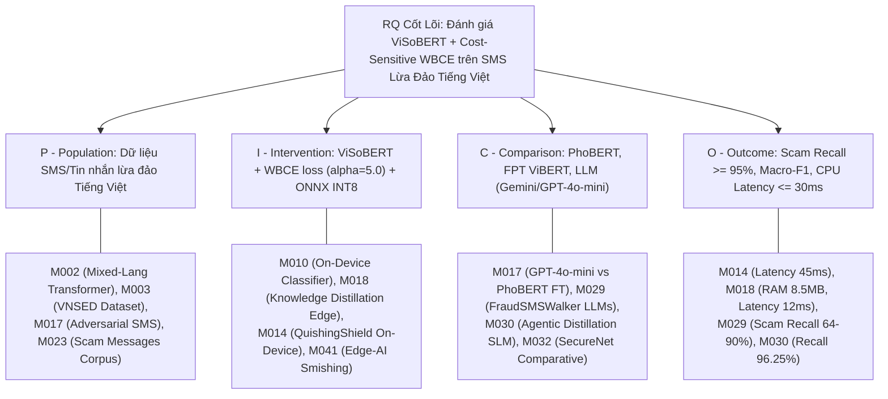

# 🗺️ BẢN ĐỒ BẰNG CHỨNG NGHIÊN CỨU (RQ EVIDENCE MAP)
### Đề tài: ScamShield-VN — Evidence-Grounded Vietnamese Scam & Phishing Detection Platform
> **File:** `team-synthesis/rq-evidence-map.md`  
> **Căn cứ:** 34 bài báo trích xuất từ [`evidence-table-merged.md`](file:///C:/Users/USER/RBL_ScamShield/team-synthesis/evidence-table-merged.md) & Khung nghiên cứu [`RBL_FRAMEWORK.md`](file:///C:/Users/USER/RBL_ScamShield/RBL_FRAMEWORK.md)

---

## 1. Bản Đồ Ánh Xạ P/I/C/O Của Đề Tài Vào Các Bài Báo Nền Tảng

---

## 2. Bảng Phân Bổ Bằng Chứng Chi Tiết Theo 4 Yếu Tố P/I/C/O

| Yếu tố PICO | Khía cạnh nghiên cứu của ScamShield-VN | Các Paper làm nền tảng khoa học | Ghi chú & Đánh giá |
| :--- | :--- | :--- | :--- |
| **P (Population)** | Phân loại tin nhắn lừa đảo, mạo danh ngân hàng và viễn thông tiếng Việt (chứa teencode, viết tắt, slang). | `M002` (Nguyen-Xuan 2026), `M003` (Nguyen Tan Cam 2026), `M017` (Asif 2026), `M023` (Xie 2025), `M025` (Saeed 2023) | Đã có dataset VNSED và các nghiên cứu về xử lý tiếng Việt pha tạp, nhưng thiếu tập benchmark SMS lừa đảo ngân hàng chuyên sâu gán nhãn đa tầng. |
| **I (Intervention)** | Mô hình ViSoBERT (tối ưu cho mạng xã hội tiếng Việt) huấn luyện với hàm mất mát nhạy cảm chi phí Weighted BCE ($\alpha=5.0$) và tối ưu suy luận On-device CPU ONNX INT8. | `M010` (Bani-Hani 2026), `M014` (Banda 2026), `M018` (Mrinal 2026), `M041` (Edge-AI Smishing 2025) | Các paper nền tảng chứng minh mô hình nén chạy Edge đạt độ trễ $12–45\text{ ms}$. Chưa có bài nào kết hợp ViSoBERT với hàm mất mát WBCE $\alpha=5.0$ để tối ưu riêng Scam Recall. |
| **C (Comparison)** | Đối chứng với PhoBERT-base-v2, FPT ViBERT-base, PhoBERT-large (370M) và mô hình LLM Few-Shot (Gemini 3.5 Flash / GPT-4o-mini). | `M017` (Asif 2026), `M023` (Xie 2025), `M029` (Zhou et al. 2026), `M030` (ElZemity et al. 2026), `M032` (SecureNet 2024) | Các paper cung cấp số liệu đối chiếu giữa fine-tuned BERT với prompt-based LLMs trên các bài toán lừa đảo SMS. |
| **O (Outcome)** | Đo đạc Scam Recall ($\ge 95\%$), Macro-F1, Precision, và Inference Latency trên CPU di động ($\le 30\text{ ms}$). | `M014` (Banda 2026), `M018` (Mrinal 2026), `M029` (FraudSMSWalker 2026), `M030` (ElZemity 2026) | Có số liệu thực chứng đối sánh: Fraud Recall của LLM từ $64.16\%$ đến $90.13\%$ (`M029`), F1 của SLM đạt $94.42\%$ (`M030`). |

---

## 3. Danh Sách Ứng Viên Phản Chứng (Counter-Evidence Candidates)

Theo quy định RBL-2, nhóm đã tiến hành rà soát toàn bộ 34 bài báo để xác định xem đã có nghiên cứu nào trả lời trực tiếp hoặc giải quyết trùng khớp với RQ của nhóm hay chưa:

| Mã Paper | Tên bài báo & Tác giả | So khớp P | So khớp I | So khớp C | So khớp O | Kết luận Phản chứng & Phân loại |
| :---: | :--- | :---: | :---: | :---: | :---: | :--- |
| `M017` | *Prompt Injection as an Architecture-Specific Attack Surface* (Asif, 2026) | Có (SMS Spam) | Không (Dùng PhoBERT FT, không có WBCE) | Có (GPT-4o-mini, Naive Bayes) | Một phần (Macro-F1, không đo Scam Recall) | **Giống 2/4 $\rightarrow$ KHÔNG PHẢN CHỨNG**. Paper tập trung vào độ bền vững tấn công injection, không giải quyết bài toán tối ưu độ nhạy lừa đảo tiếng Việt. |
| `M023` | *Comparing KNN, Logistic Regression, Random Forest and BERT Fine-Tuning* (Xie, 2025) | Có (Scam Messages) | Không (Chỉ dùng BERT chuẩn) | Có (Traditional ML) | Một phần (Accuracy, không đo Recall) | **Giống 2/4 $\rightarrow$ KHÔNG PHẢN CHỨNG**. Chỉ so sánh các thuật toán ML truyền thống với BERT gốc, không có cơ chế phạt mất cân bằng nhãn. |
| `M029` | *FraudSMSWalker: Benchmarking Agentic LLMs for SMS Fraud* (Zhou et al., 2026) | Có (SMS Fraud) | Không (Dùng Agentic LLMs: Qwen, GPT-5, Gemini) | Có (LLMs đối sánh) | Có (Fraud Recall, Benign Recall) | **Giống 3/4 $\rightarrow$ MỞ RỘNG (EXTENSION)**. Paper chứng minh LLMs chỉ đạt Fraud Recall trung bình $64–90\%$, khẳng định khoảng trống cần có mô hình ngôn ngữ địa phương hóa nhạy cảm chi phí. |
| `M030` | *Agentic Knowledge Distillation for SMS Threat Detection* (ElZemity et al., 2026) | Có (SMS Threat) | Không (Chưng cất Qwen2.5/SmolLM2 từ Claude/GPT) | Có (DPO Baseline) | Có (Recall, F1-score) | **Giống 3/4 $\rightarrow$ MỞ RỘNG (EXTENSION)**. Đạt Recall $96.25\%$ trên tiếng Anh bằng SLM, nhưng chưa từng được kiểm chứng trên ngôn ngữ tiếng Việt giàu teencode. |

---

## 4. Kết Luận Kiểm Chứng Tính Mới (Novelty Claim)
* **Không có bài báo nào giống đủ 4/4 yếu tố P/I/C/O** $\rightarrow$ Đề tài **KHÔNG BỊ TRÙNG LẶP (No Replication)**.
* **Có 2 bài báo đạt mức tương đồng 3/4 yếu tố (`M029`, `M030`)** $\rightarrow$ Đề tài được phân loại chính xác là **MỞ RỘNG NGHIÊN CỨU (Research Extension)**.
* **Đóng góp mới cụ thể của nhóm:**
  1. Là nghiên cứu đầu tiên áp dụng mô hình chuyên biệt hóa mạng xã hội tiếng Việt (**ViSoBERT**) kết hợp hàm tổn thất nhạy cảm chi phí **Cost-Sensitive WBCE ($\alpha=5.0$)** để giải quyết triệt để vấn đề bỏ sót tin nhắn lừa đảo.
  2. Cung cấp bộ dữ liệu thực nghiệm chuẩn hóa $2.665$ mẫu SMS tiếng Việt và bộ kiểm thử niêm phong Frozen Test Set ($N=267$) được lượng hóa độ trễ thực tế trên CPU Edge Device qua định dạng ONNX INT8.
